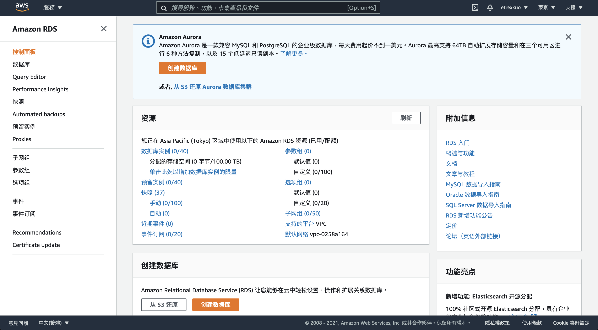
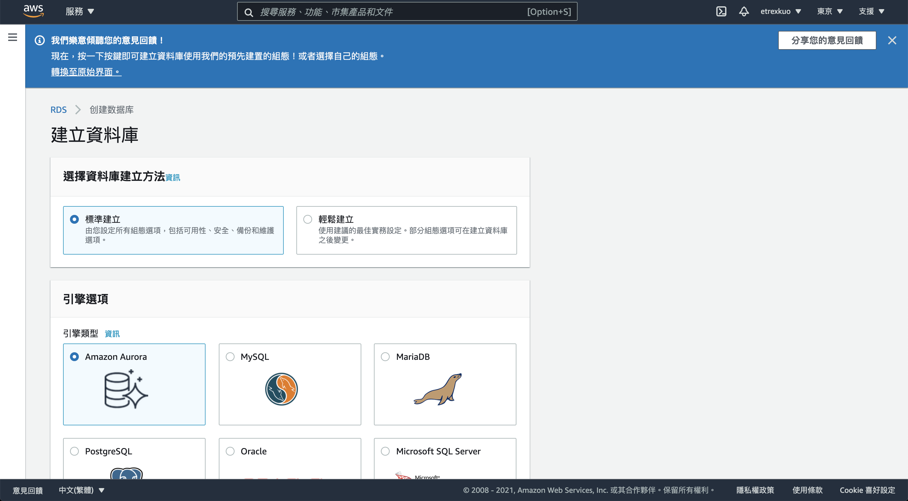
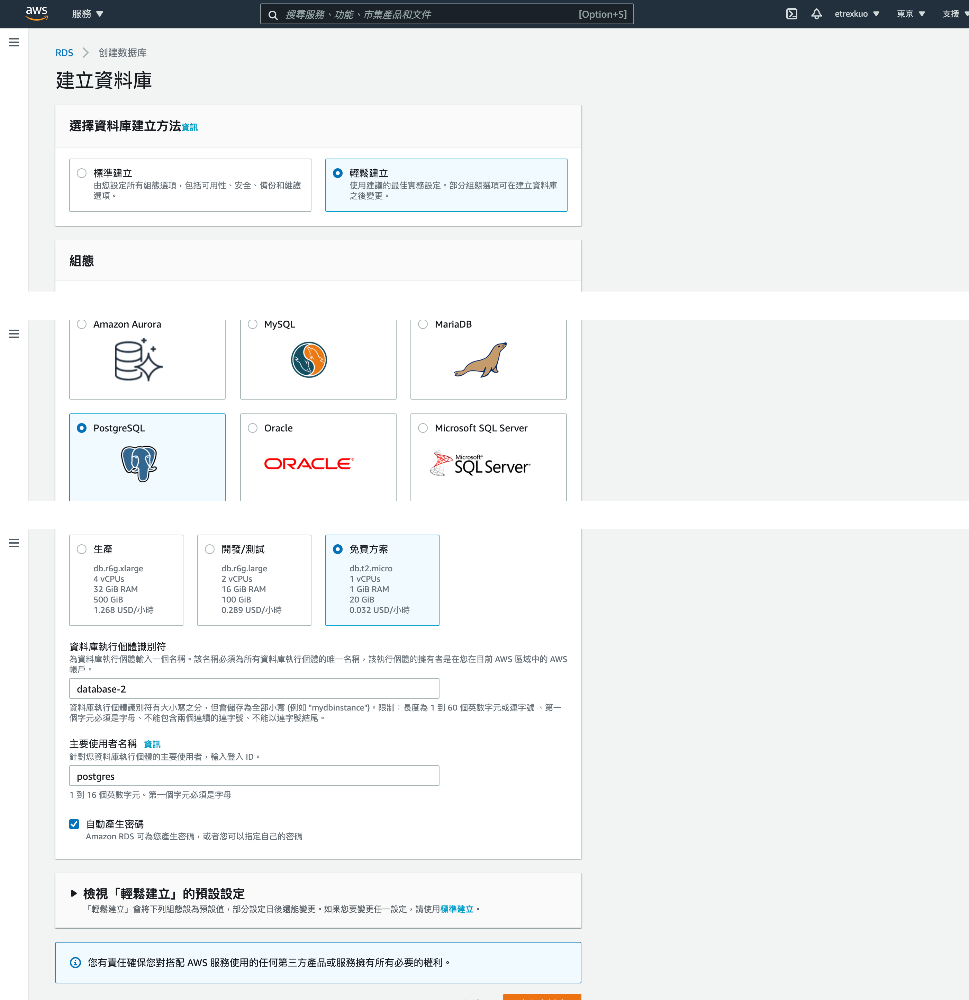
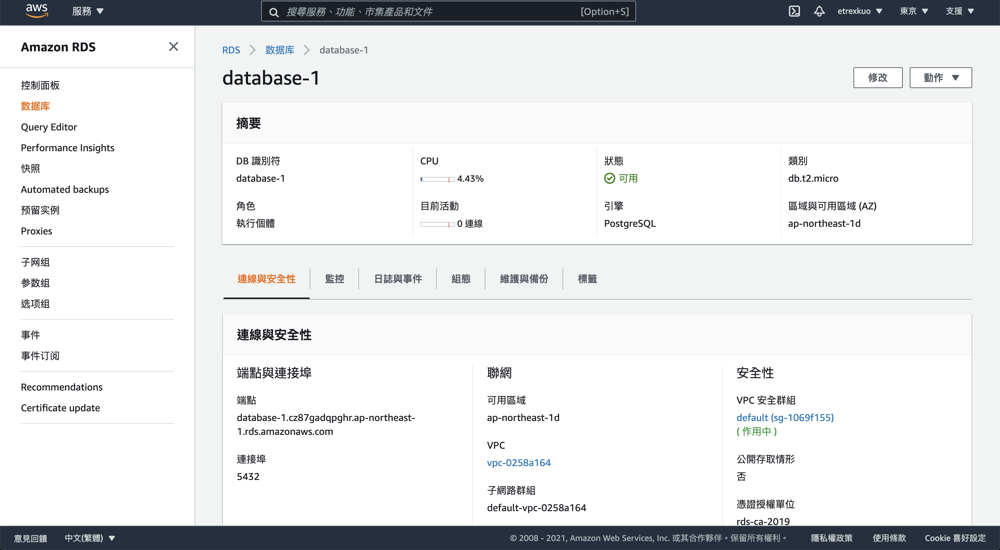

# 在 AWS RDS 上使用 Postgresql

# 使用者名稱

postgres

# 密碼

自行輸入

# 設定可公開連線

是

# 修改 VPC 安全組

POSTGRESQL 流入 0.0.0.0/0

# 連線到 DB

psql postgresql://postgres@database-2.cz87gadqpghr.ap-northeast-1.rds.amazonaws.com

