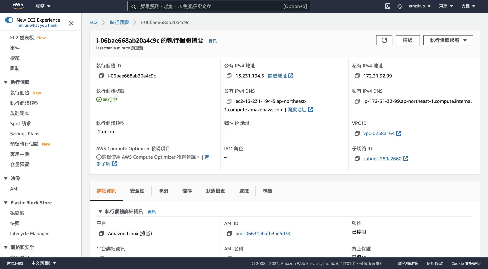

# 設定 AWS EC2 的 SSH 連線

ssh 指令需要金鑰、用戶名稱和 Host 三個資訊。

- 金鑰: 就是下載下來的 `aws.pem` 檔案
- 用戶名稱: 固定為 `ec2-user`
- Host: 就是在 AWS EC2 執行個體內頁的公有 IPv4 DNS

連線指令為：

```
ssh -i 金鑰檔案路徑 用戶名稱@Host
```

# 取得金鑰

在建立執行個體時，下載的 `aws.pem` 檔案即為金鑰。

# 取得用戶名稱

在[官方文件](https://docs.aws.amazon.com/zh_tw/AWSEC2/latest/UserGuide/TroubleshootingInstancesConnecting.html)中提到：

> 針對啟動執行個體的 AMI，取得預設使用者名稱：
> - 針對 Amazon Linux 2 或 Amazon Linux AMI，使用者名稱為 ec2-user。
> - 針對 CentOS AMI，使用者名稱為 centos。
> - 針對 Debian AMI，使用者名稱為 admin。
> - 針對 Fedora AMI，使用者名稱為 ec2-user 或 fedora。
> - 針對 RHEL AMI，使用者名稱為 ec2-user 或 root。
> - 針對 SUSE AMI，使用者名稱為 ec2-user 或 root。
> - 針對 Ubuntu AMI，使用者名稱為 ubuntu。
> 萬一 ec2-user 和 root 無法使用，請洽詢 AMI 供應商。

# 取得 Host

在執行個體中的`公有 IPv4 DNS`資訊就是 Host。

# 連線示範

以下圖為例：



可以看出我的 `公有 IPv4 DNS` 是 `ec2-13-231-194-5.ap-northeast-1.compute.amazonaws.com`。

而我的金鑰放在 `~/.ssh` 資料夾下。

所以我的完整連線資訊如下：

- 金鑰: `~/.ssh/aws.pem`
- 用戶名稱: `ec2-user`
- Host: `ec2-13-231-194-5.ap-northeast-1.compute.amazonaws.com`

## 直接連線

```bash
ssh -i ~/.ssh/aws.pem ec2-user@ec2-13-231-194-5.ap-northeast-1.compute.amazonaws.com
```

輸入後會看到：

```bash
The authenticity of host 'ec2-13-231-194-5.ap-northeast-1.compute.amazonaws.com (13.231.194.5)' can't be established.
ECDSA key fingerprint is SHA256:fyGXFib97wlzCOpkDYvt95UroUOd16GuBL18S1hFybk.
Are you sure you want to continue connecting (yes/no/[fingerprint])? yes
```

輸入 yes 後按下 enter：

```bash

       __|  __|_  )
       _|  (     /   Amazon Linux 2 AMI
      ___|\___|___|

https://aws.amazon.com/amazon-linux-2/
[ec2-user@ip-172-31-32-99 ~]$
```

看到此畫面代表連線成功。

## 透過 config 設定來連線

編輯 `~/.ssh/config` 檔案，並且輸入以下內容：

```
Host aws
  HostName ec2-13-231-194-5.ap-northeast-1.compute.amazonaws.com
  User ec2-user
	IdentityFile ~/.ssh/aws.pem
  ForwardAgent yes
```

存檔後，可使用以下指令來連線：

```bash
ssh aws
```

其結果相當於使用直接連線的指令。