# AWS SQS 試用

## 建立 SQS

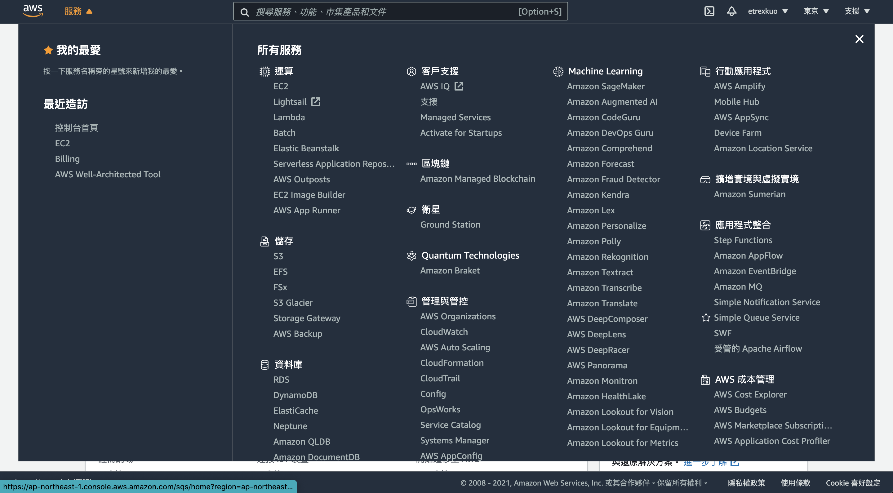

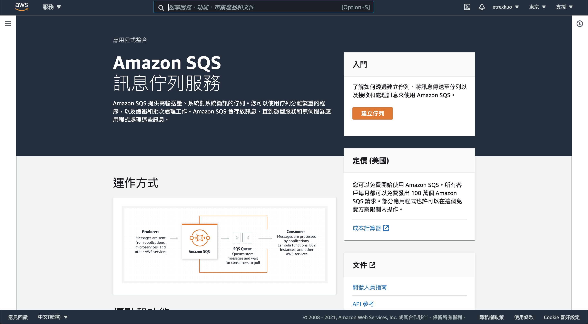

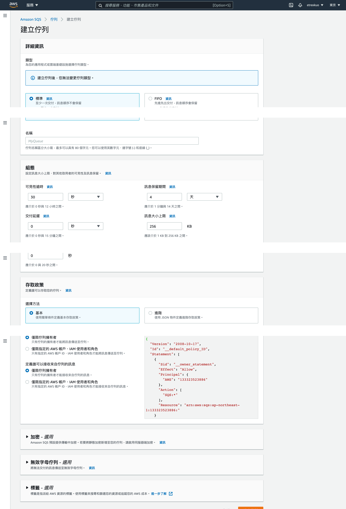

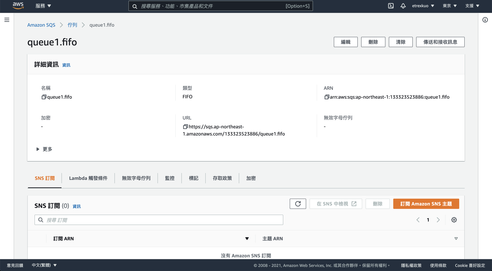


以下內容摘自：[https://docs.aws.amazon.com/zh_tw/sdk-for-javascript/v2/developer-guide/sqs-examples-send-receive-messages.html](https://docs.aws.amazon.com/zh_tw/sdk-for-javascript/v2/developer-guide/sqs-examples-send-receive-messages.html)

## 傳送訊息至佇列

建立 `sqs_sendmessage.js` 檔案內容如下：

```javascript
// Load the AWS SDK for Node.js
var AWS = require('aws-sdk');
// Set the region
AWS.config.update({region: 'REGION'});

// Create an SQS service object
var sqs = new AWS.SQS({apiVersion: '2012-11-05'});

var params = {
   // Remove DelaySeconds parameter and value for FIFO queues
  DelaySeconds: 10,
  MessageAttributes: {
    "Title": {
      DataType: "String",
      StringValue: "The Whistler"
    },
    "Author": {
      DataType: "String",
      StringValue: "John Grisham"
    },
    "WeeksOn": {
      DataType: "Number",
      StringValue: "6"
    }
  },
  MessageBody: "Information about current NY Times fiction bestseller for week of 12/11/2016.",
  // MessageDeduplicationId: "TheWhistler",  // Required for FIFO queues
  // MessageGroupId: "Group1",  // Required for FIFO queues
  QueueUrl: "SQS_QUEUE_URL"
};

sqs.sendMessage(params, function(err, data) {
  if (err) {
    console.log("Error", err);
  } else {
    console.log("Success", data.MessageId);
  }
});

```

## 從佇列接收並刪除訊息

建立 `sqs_receivemessage.js` 檔案內容如下：

```javascript
// Load the AWS SDK for Node.js
var AWS = require('aws-sdk');
// Set the region
AWS.config.update({region: 'REGION'});

// Create an SQS service object
var sqs = new AWS.SQS({apiVersion: '2012-11-05'});

var queueURL = "SQS_QUEUE_URL";

var params = {
 AttributeNames: [
    "SentTimestamp"
 ],
 MaxNumberOfMessages: 10,
 MessageAttributeNames: [
    "All"
 ],
 QueueUrl: queueURL,
 VisibilityTimeout: 20,
 WaitTimeSeconds: 0
};

sqs.receiveMessage(params, function(err, data) {
  if (err) {
    console.log("Receive Error", err);
  } else if (data.Messages) {
    var deleteParams = {
      QueueUrl: queueURL,
      ReceiptHandle: data.Messages[0].ReceiptHandle
    };
    sqs.deleteMessage(deleteParams, function(err, data) {
      if (err) {
        console.log("Delete Error", err);
      } else {
        console.log("Message Deleted", data);
      }
    });
  }
});

```

# AWS IAM

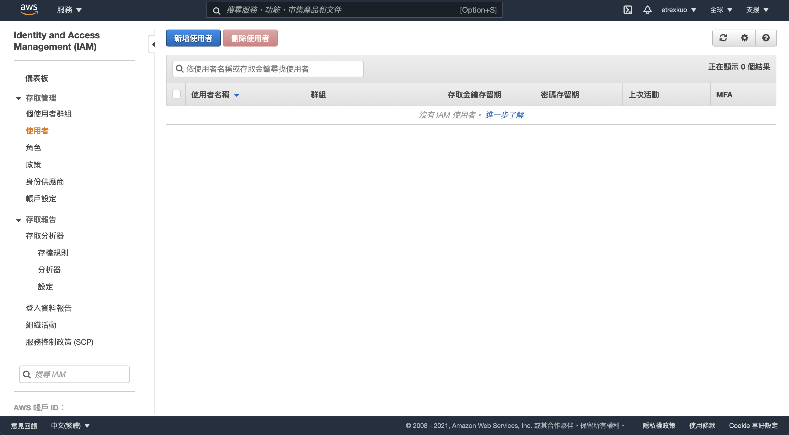

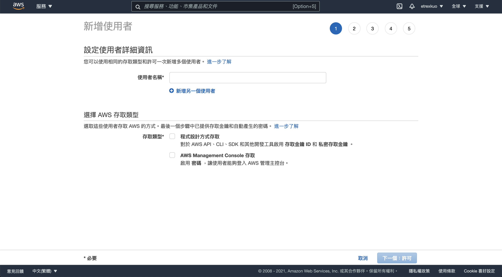

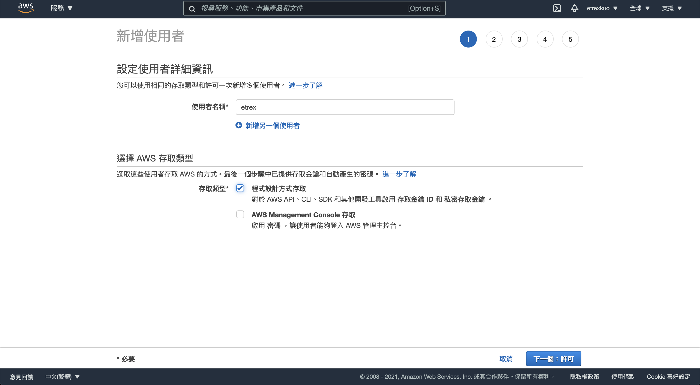

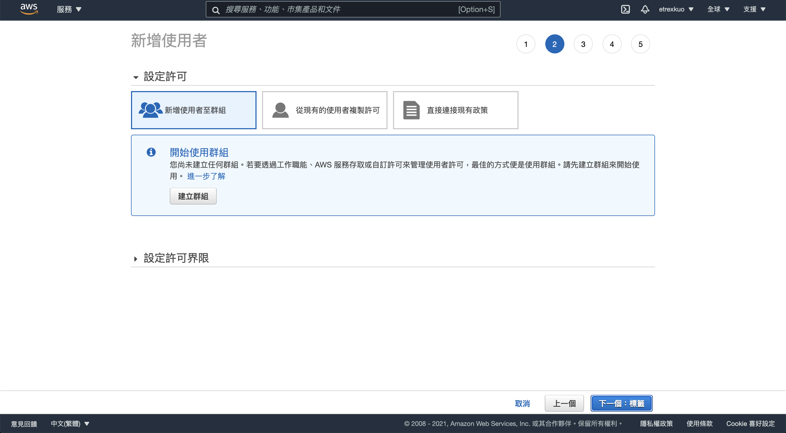

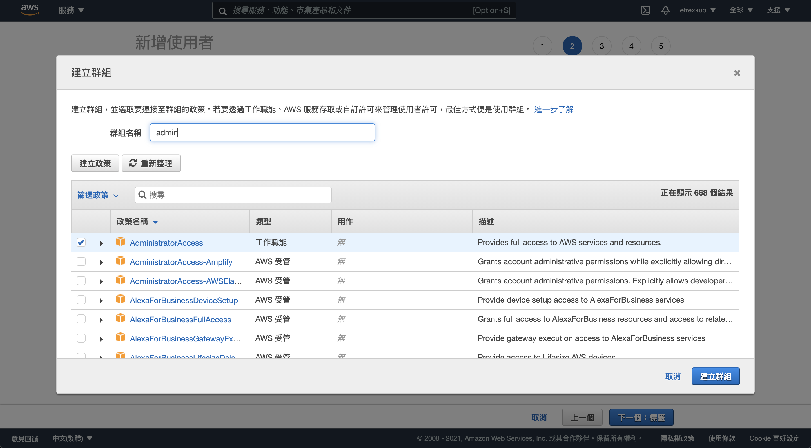

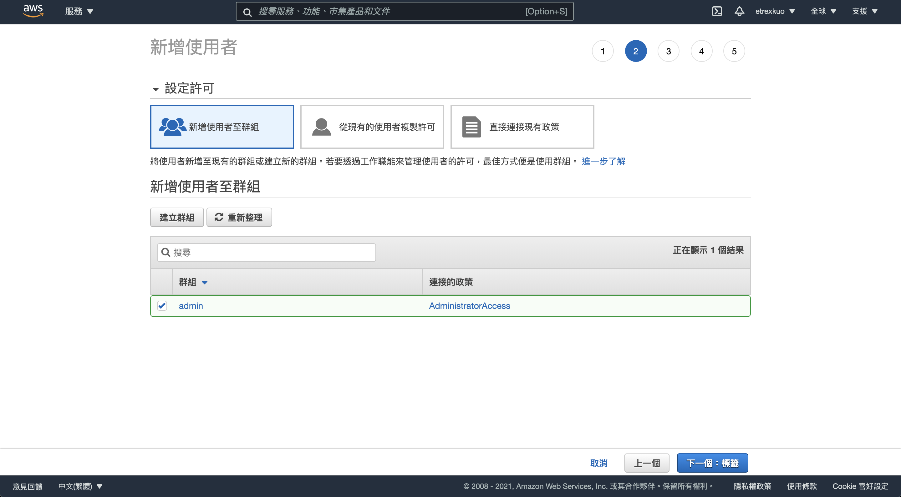

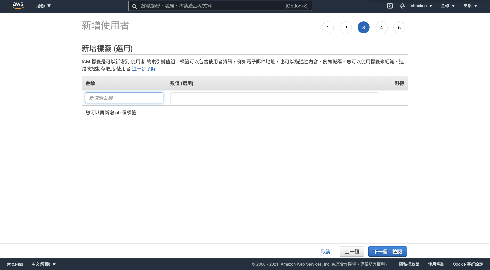

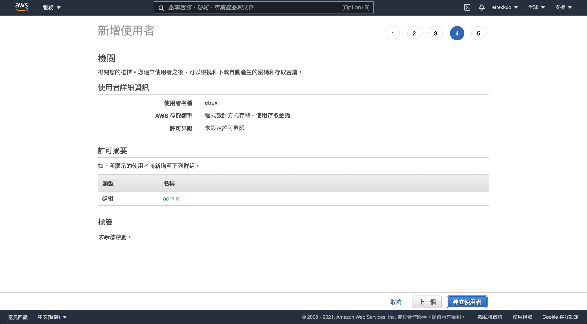

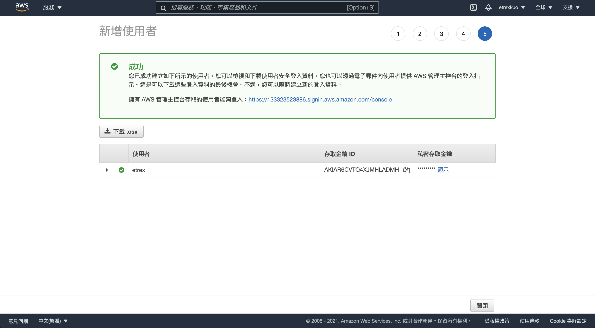
