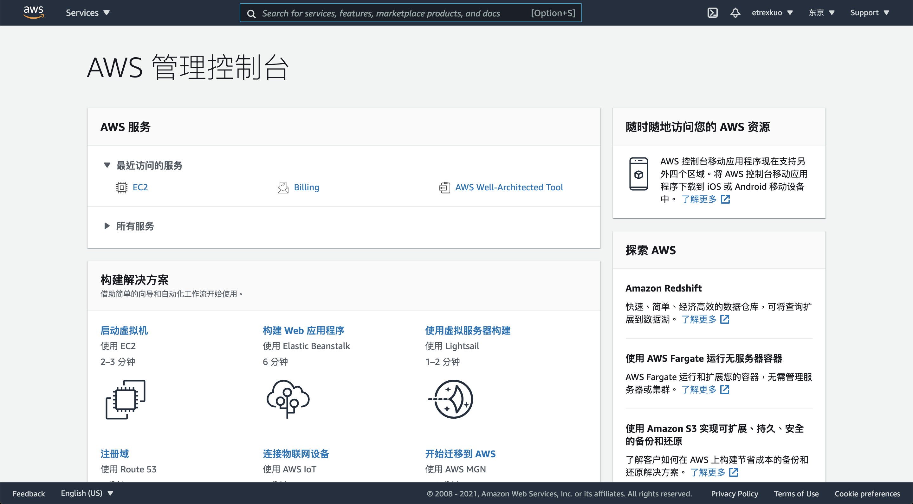
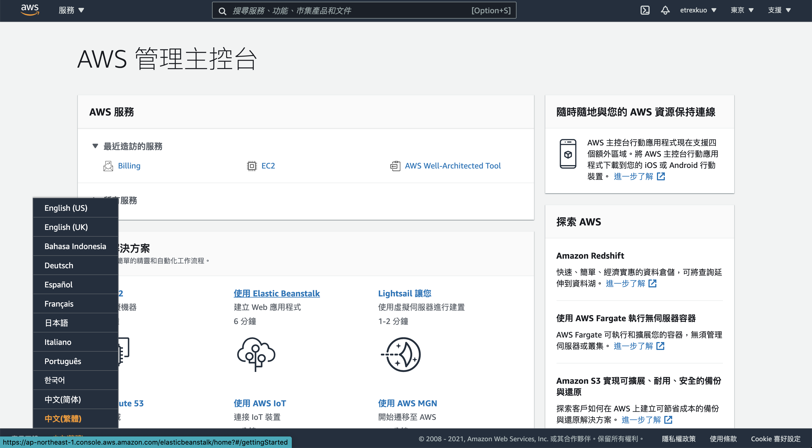
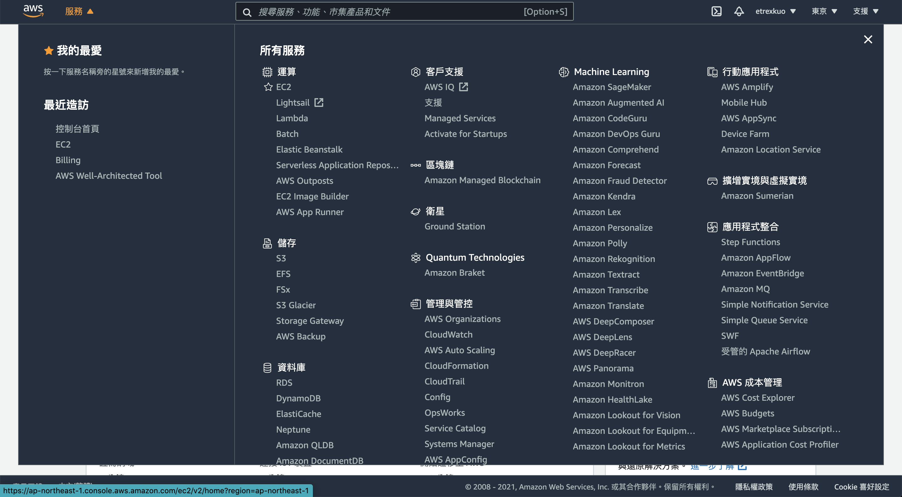
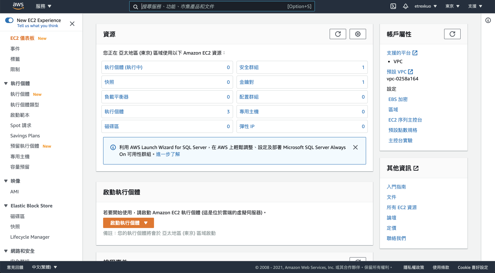
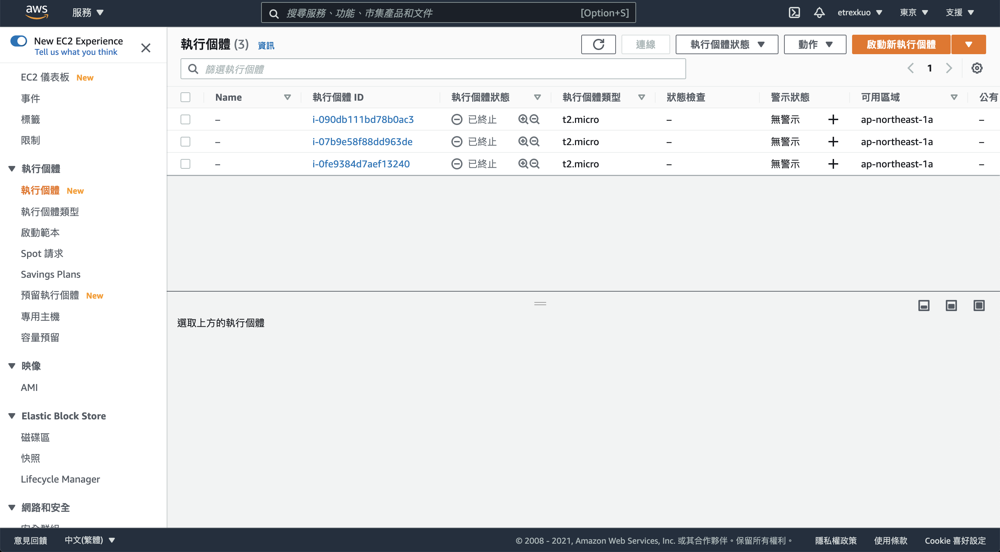
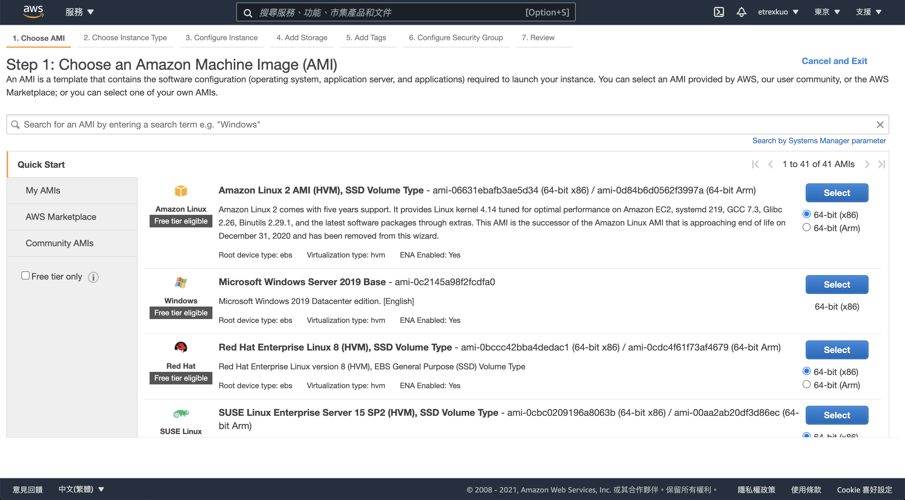
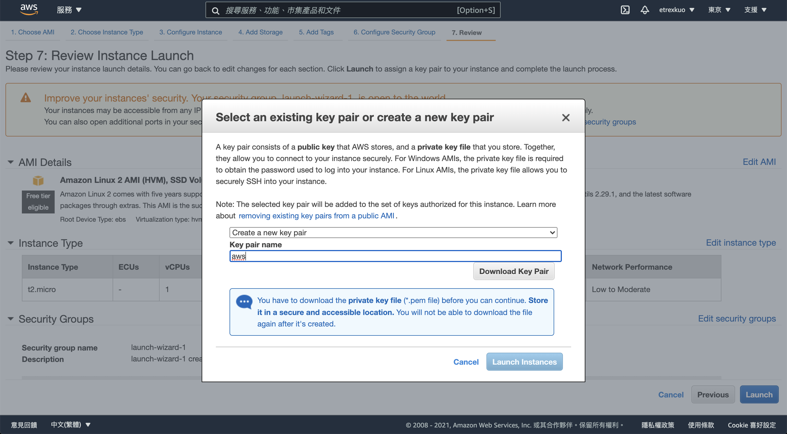
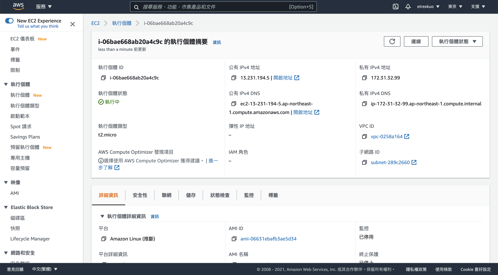

# 建立 AWS EC2 實例

https://aws.amazon.com/

點擊 `AWS 管理主控台` 或 `登入主控台`：

點選左下角的語系設定，切換到`中文(繁體)`：

點擊左上角 `服務`：

點擊 `EC2`：

點擊 左側選單的 `執行個體`：

點擊右側的 `啟動新執行個體`：

點擊 `Select` 選擇第一個項目，也就是 Amazon Linux 2 AMI (HVM), SSD Volume Type：

點擊 `Review and Launch`：

點擊 `Launch`：

在 Select an existing key pair or create a new key pair 表單中，填入：

- `Create a new key pair`
- Key pair name: `aws`

點擊 `Download Key Pair`，保存檔案後按下 `Launch Instances`：

點擊右下角 `View Instances`

點擊剛建立好的執行個體的超連結進入內頁：

看到這個畫面就完成了。