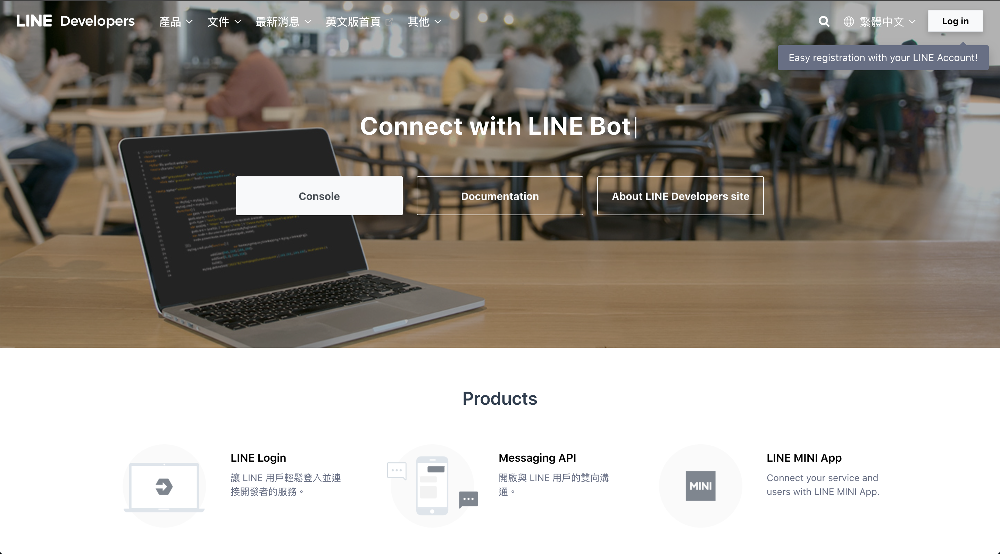
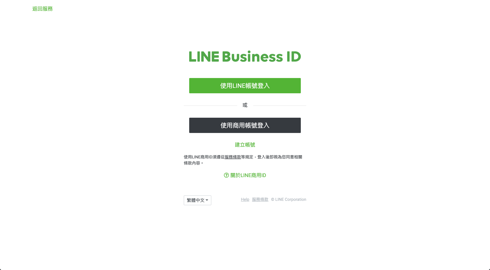

# 註冊 LINE 開發者帳號

開啟網頁：https://developers.line.biz/zh-hant/

點擊右上角 `Log In`：

點擊 `使用LINE帳號登入`：

輸入 LINE 帳號密碼後，按下`登入`：

開啟手機 LINE APP 填入驗證碼，進行驗證。

登入完成後，可以看到建立 LINE 開發者帳號的表單，請輸入以下資訊：

- Your name：你的姓名
- Your email：你的信箱

勾選 I have read and agree to the LINE Developers Agreement 後，點擊 `Create my account`：

Provider 代表聊天機器人的製造商，一般是採用公司名稱或個人名稱，這個資訊會顯示在機器人的簡介上。

在這裡點擊 `Create a new provider`：

建立 Provider 的表單，請輸入以下資訊：

- Provider name：這裡輸入你的姓名

填完之後按下 `Create`：

看到這個畫面就完成了！