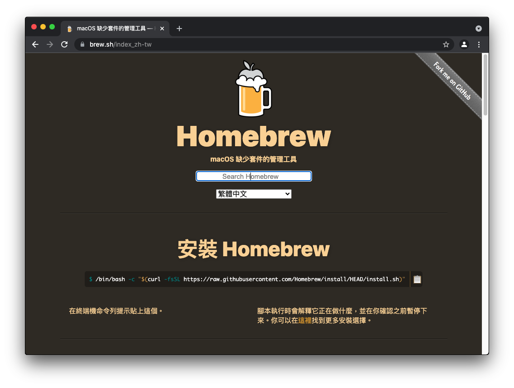
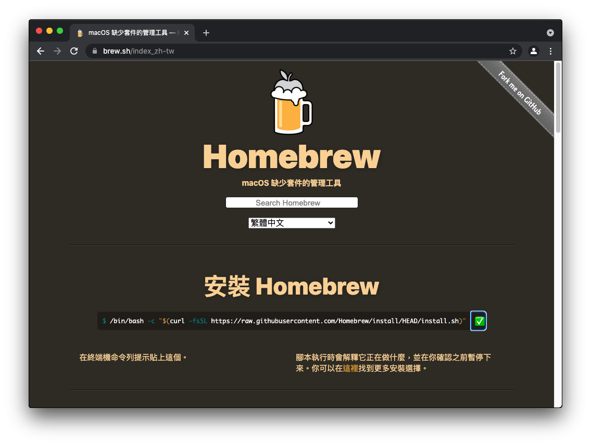
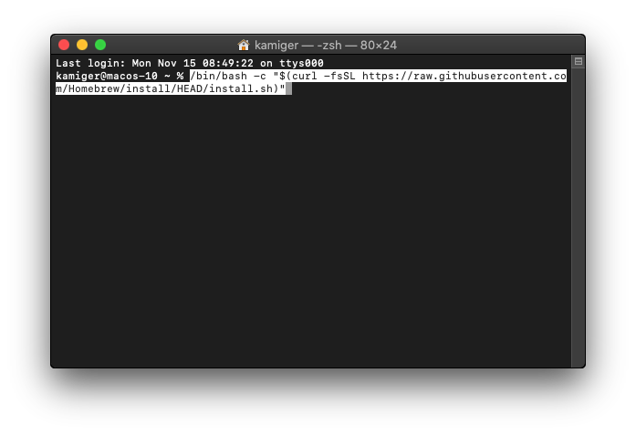
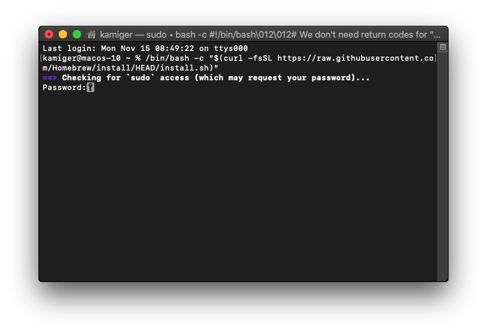
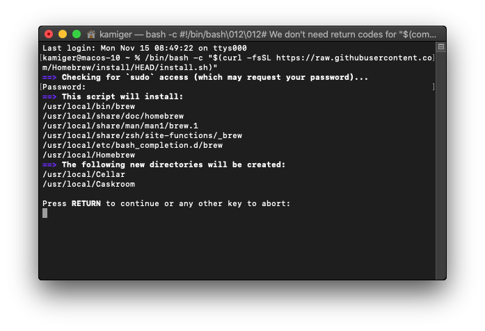
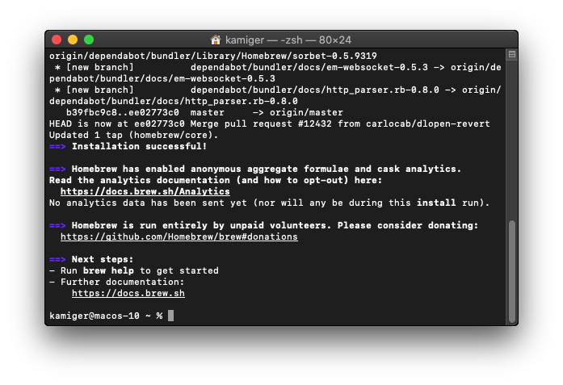
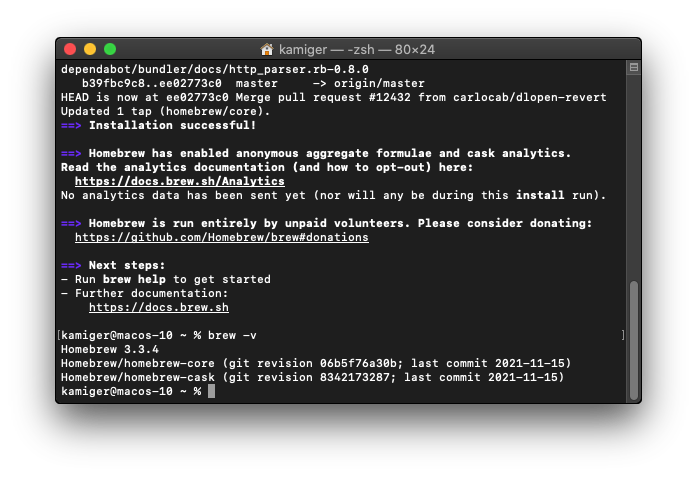

# 在 MacOS Catalina 安裝 Brew

開啟網頁 [https://brew.sh/index_zh-tw](https://brew.sh/index_zh-tw)：

  

點擊複製按鈕：

  

在終端機輸入 `/bin/bash -c "$(curl -fsSL https://raw.githubusercontent.com/Homebrew/install/HEAD/install.sh)"`：

 

按下 `Enter`：

  

輸入你登入 MacOS 時使用的密碼後，按下 `Enter`：

  

再次按下 `Enter`：

  

brew 安裝完成。

# 確認是否安裝完成

在終端機輸入 `brew -v` 查看版本：

  

如上圖即為安裝完成。