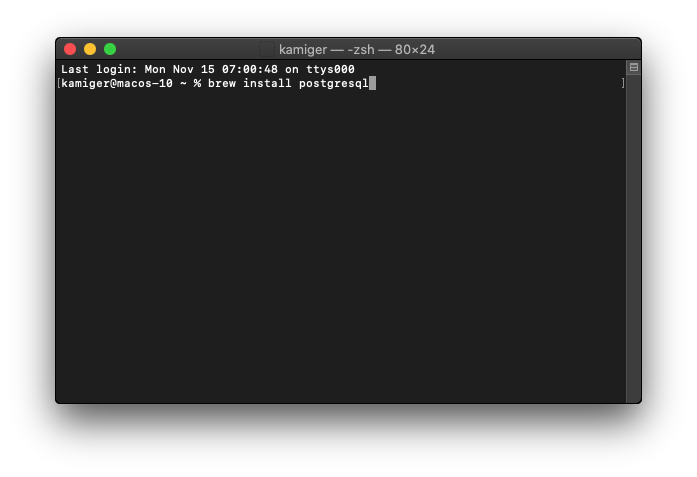
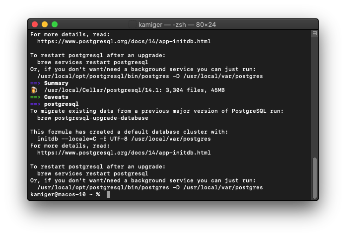
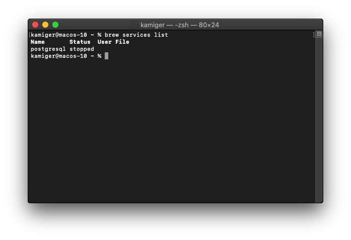
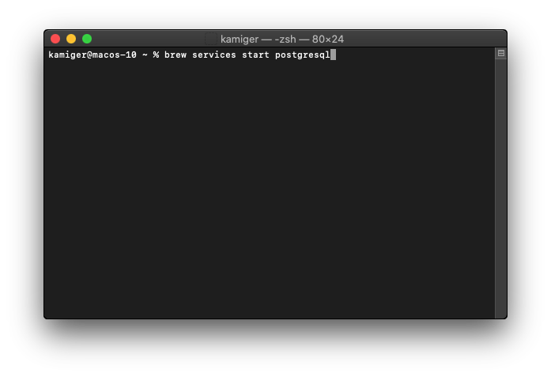
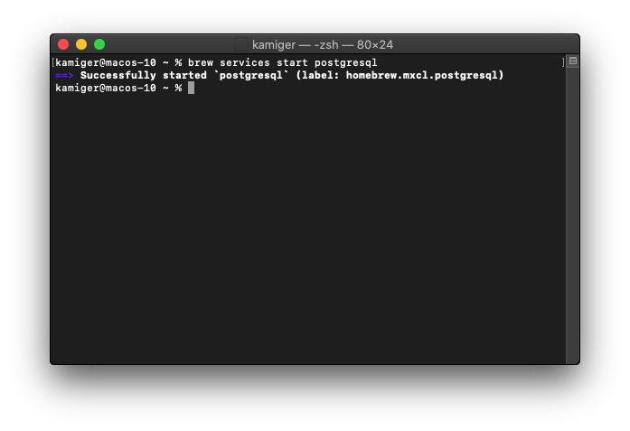
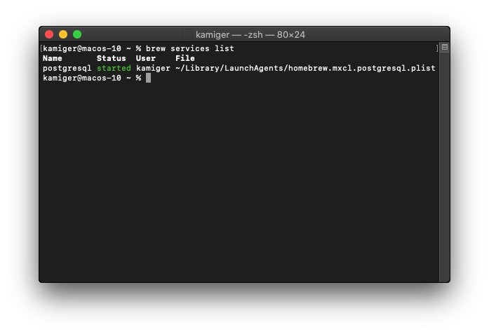
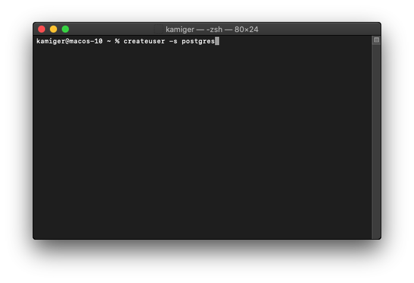
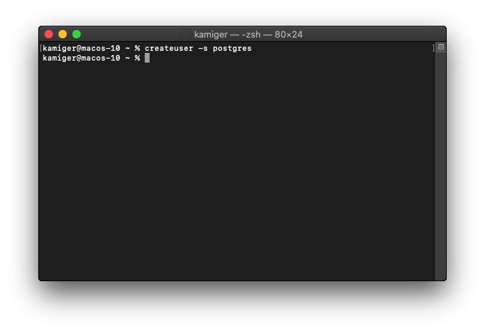
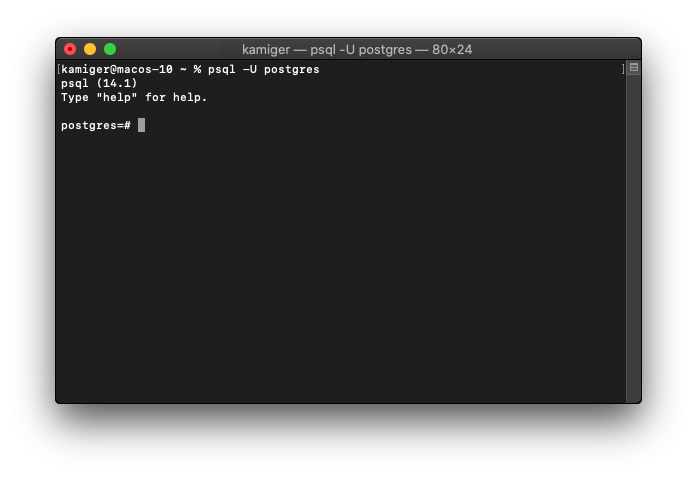

# 在 MacOS Catalina 安裝 PostgreSQL

# 安裝 PostgreSQL

在終端機輸入 `brew install postgresql`：

  

按下 `Enter`：

  

就安裝完成了。

# 啟動 PostgreSQL 伺服器

在終端機輸入 `brew services list`：

  

可以看見目前 postgresql 是沒有執行中。

輸入 `brew services start postgresql`：

  

按下 `Enter`：

  

可以看見成功啟動 postgresql。

再次輸入 `brew services list`：

  

可以看到現在 postgresql 變成執行中。

# 建立資料庫預設使用者

在終端機輸入 `createuser -s postgres`：

  

按下 `Enter`：

  

就完成了。

# 連線到資料庫伺服器

輸入 `psql -U postgres` 指定使用 postgres 帳號登入 PostgreSQL 伺服器：

  

按下 `Enter`：

  

看到上述畫面表示登入成功。

可以直接關閉畫面，或者輸入 `exit` 登出。
