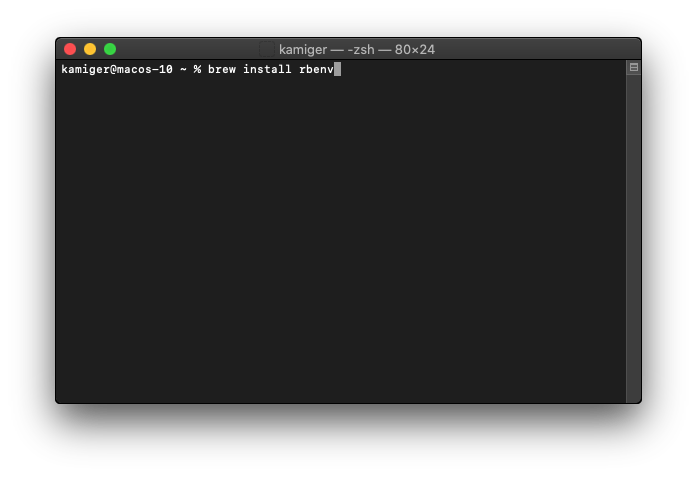
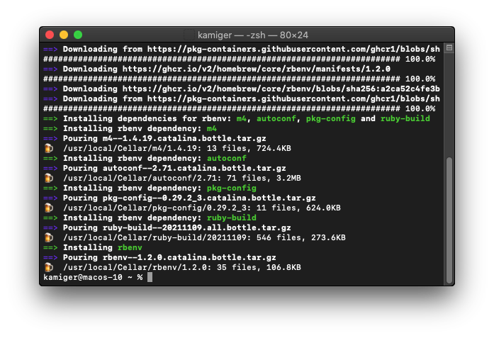
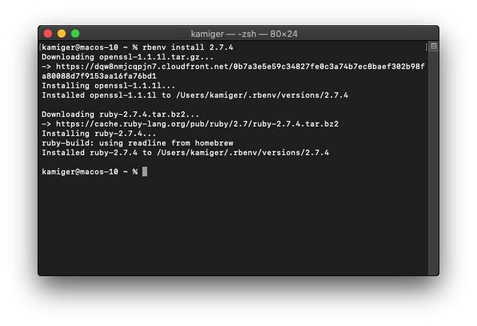

# 在 MacOS Catalina 安裝 Ruby

以下教學將使用 rbenv 作為安裝 ruby 的工具，rbenv 是一款讓你可以安裝多個 ruby 版本，並且隨意切換要使用的 ruby 版本的工具。

# 安裝 rbenv

在終端機輸入 `brew install rbenv`：

  

按下 `Enter` 開始安裝。

  

# 確認 rbenv 是否安裝完成

rbenv 安裝完成後，輸入 `rbenv -v` 查看版本。

  

# rbenv 初始化

如果你使用的是 zsh，在終端機輸入以下指令：

`echo 'export PATH="$HOME/.rbenv/bin:$PATH"' >> ~/.zshrc`：

  

`echo 'eval "$(rbenv init -)"' >> ~/.zshrc`：

  

輸入完成後的畫面：

  

如果你使用的是 bash，在終端機輸入以下指令：

- `echo 'export PATH="$HOME/.rbenv/bin:$PATH"' >> ~/.bashrc`
- `echo 'eval "$(rbenv init -)"' >> ~/.bashrc`

如果你不知道你用的終端機是什麼，那就以上四個指令都輸入一遍就對了。

# 使用 rbenv 安裝 ruby 2.7.4

在安裝 ruby 之前需要關掉重開終端機。

在終端機輸入 `rbenv install 2.7.4`：

  

按下 `Enter`：

  

ruby 2.7.4 安裝完成後，還需要指定預設使用的 ruby 版本為 2.7.4。

在終端機輸入 `rbenv global 2.7.4`：

  

# 確認是否安裝完成

在終端機輸入 `ruby -v`：

  

看到 `ruby 2.7.4...` 就代表安裝完成。