# 在 MacOS Catalina 安裝 Sourcetree

開啟網頁 [https://www.sourcetreeapp.com/](https://www.sourcetreeapp.com/)：

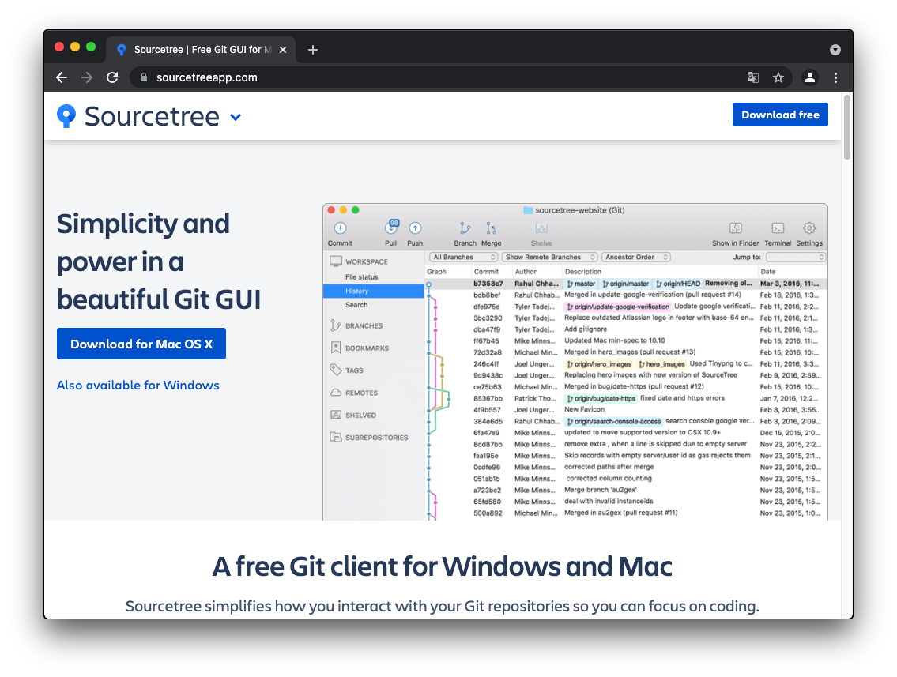  

點擊 `Download for Mac OS X`：

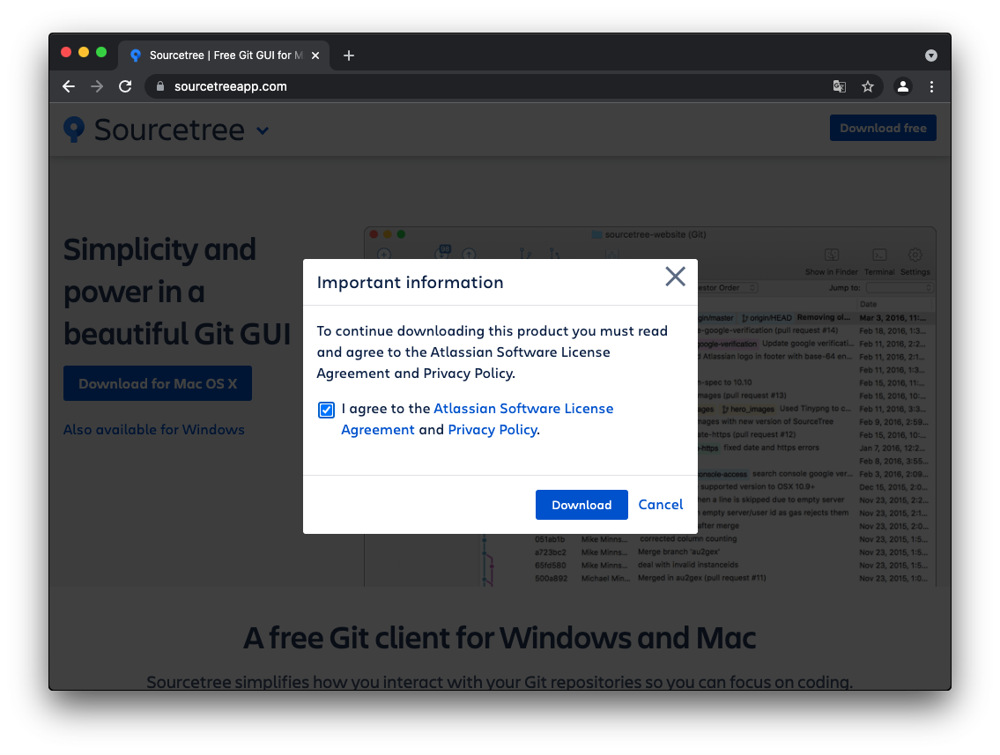  

勾選同意條款後，按下 `Download`，下載後解壓縮，並且丟入應用程式資料夾下，雙擊啟動 Sourcetree：

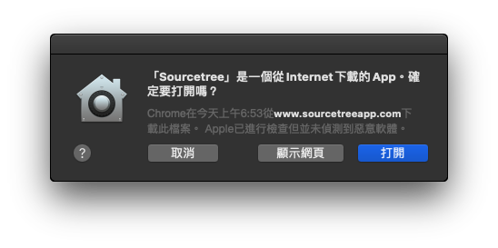  

點擊 `打開`：

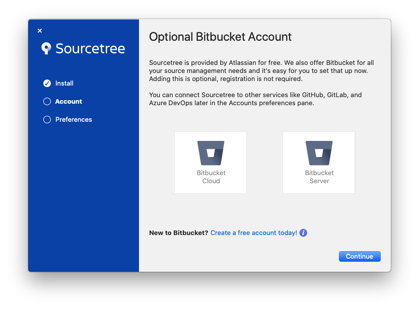  

點擊 `Continue`：

  

勾選 `Set global author details for Git and Mercurial` 後，輸入名稱以及 email：

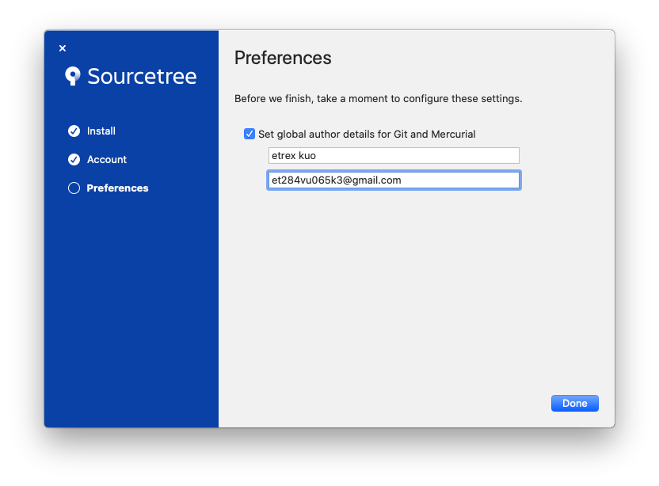  

點擊 `Done`：

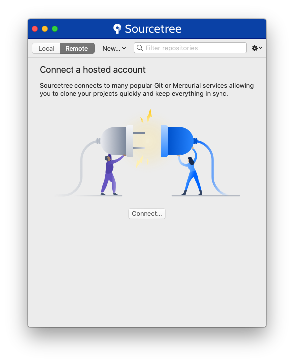  

點擊 `Connect...`：

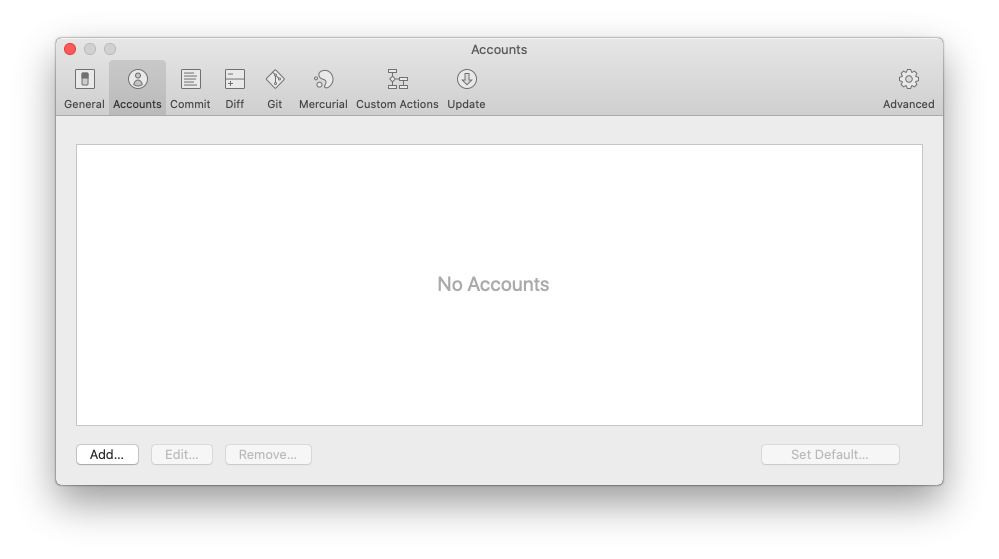  

點擊 `Add...`：

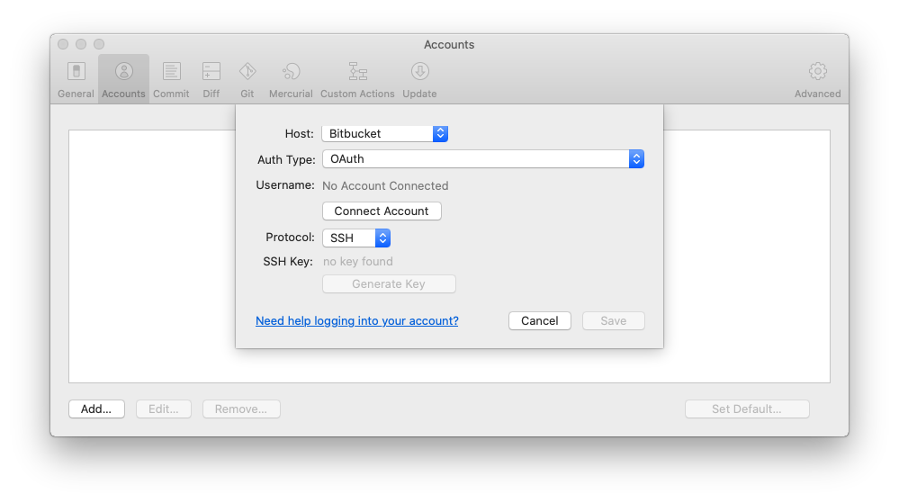  

將 Host 改為 GitHub，並且將 Protocol 改為 HTTPS：

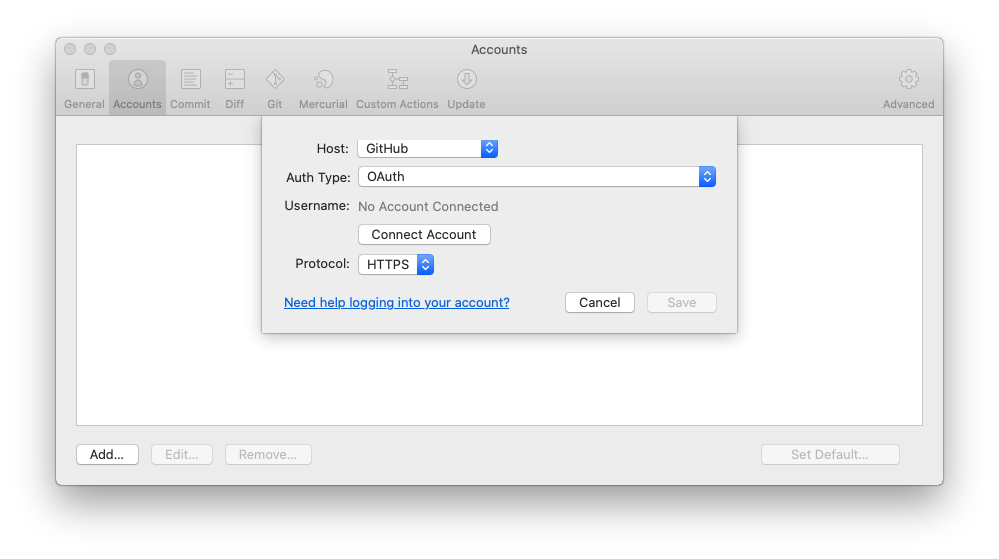  

點擊 `Connect Account`：

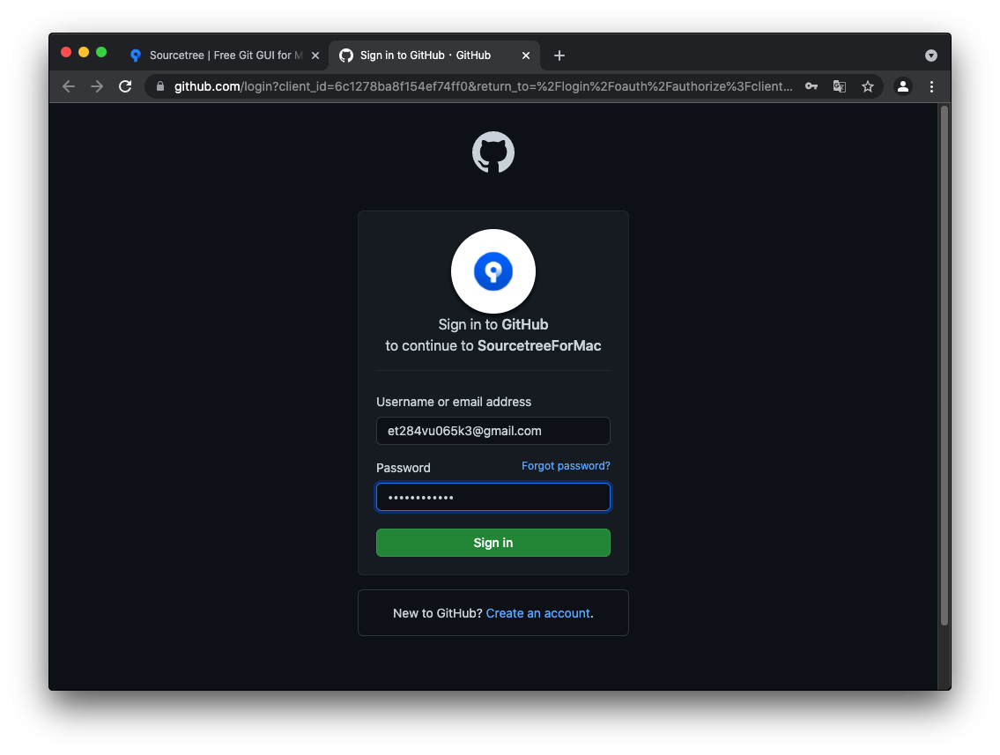  

登入 GitHub 帳號。

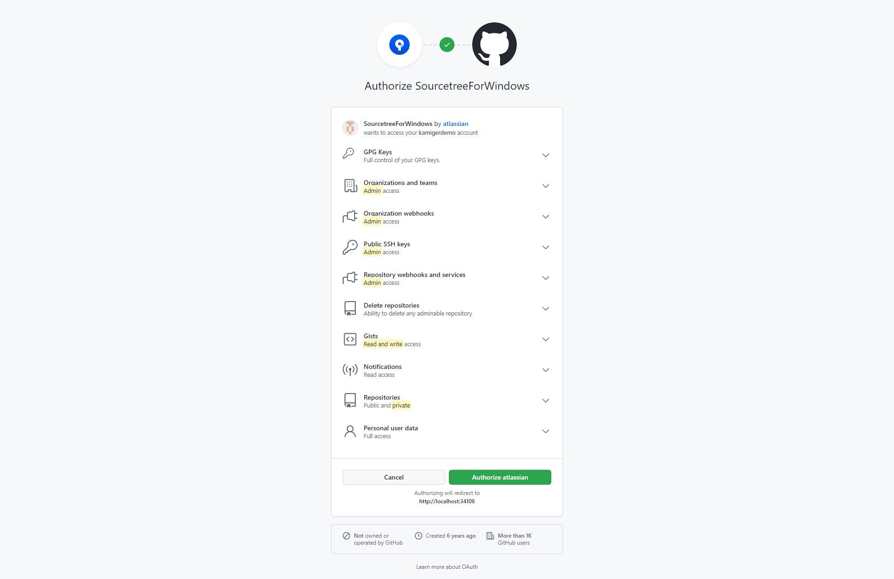  

點擊 `Authorize atlassian` 授權 GitHub 權限給 Sourcetree：

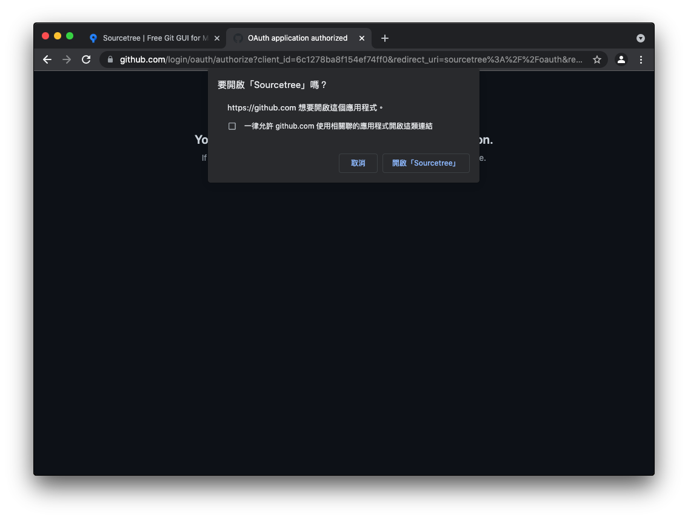  

點擊 `開啟「Sourcetree」`：

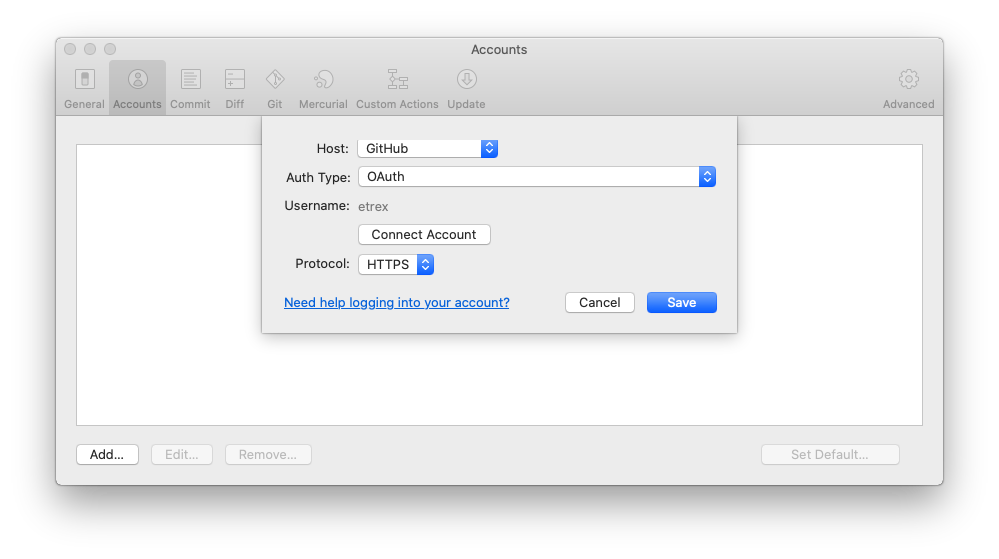  

點擊 `Save`：

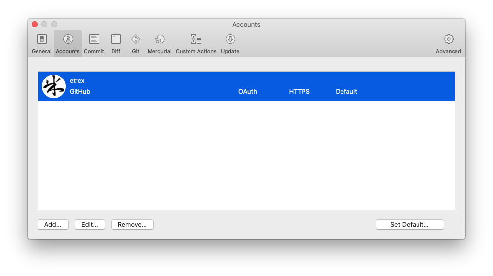  

已完成與 GitHub 的連結，點擊左上角紅點點關閉此畫面：

# 下載程式碼

在 Sourcetree 的 Remote 分頁可下載程式碼，在以下這個範例我下載的專案名稱為 free_chatbot_book：

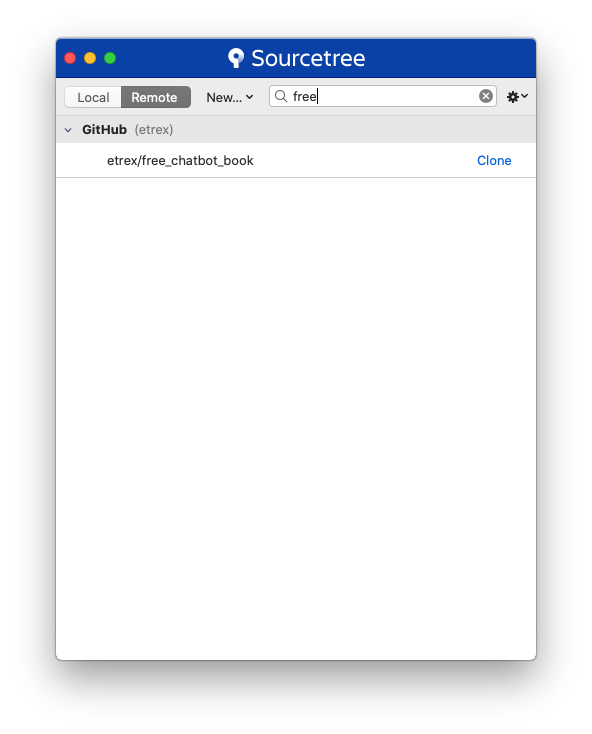  

點擊 `Clone`：

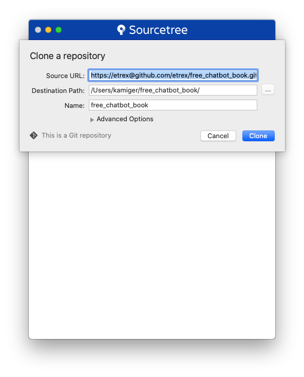  

在這個畫面可以設定下載目的地，預設的目的地是在用戶根目錄下。

再次點擊 `Clone` 後，畫面會切換到 Local，並且開始下載程式碼：

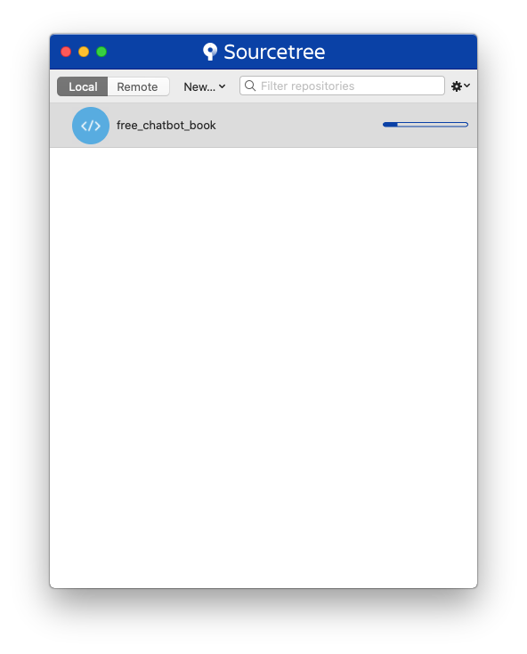  

下載完成後點擊進入，會看到以下畫面：

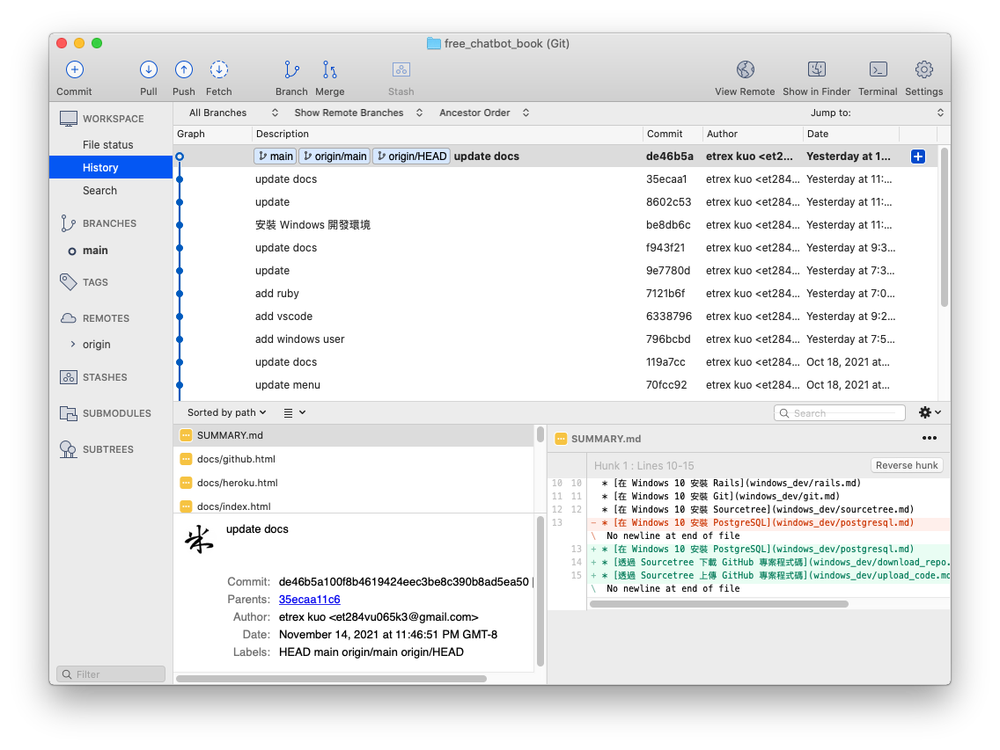  
