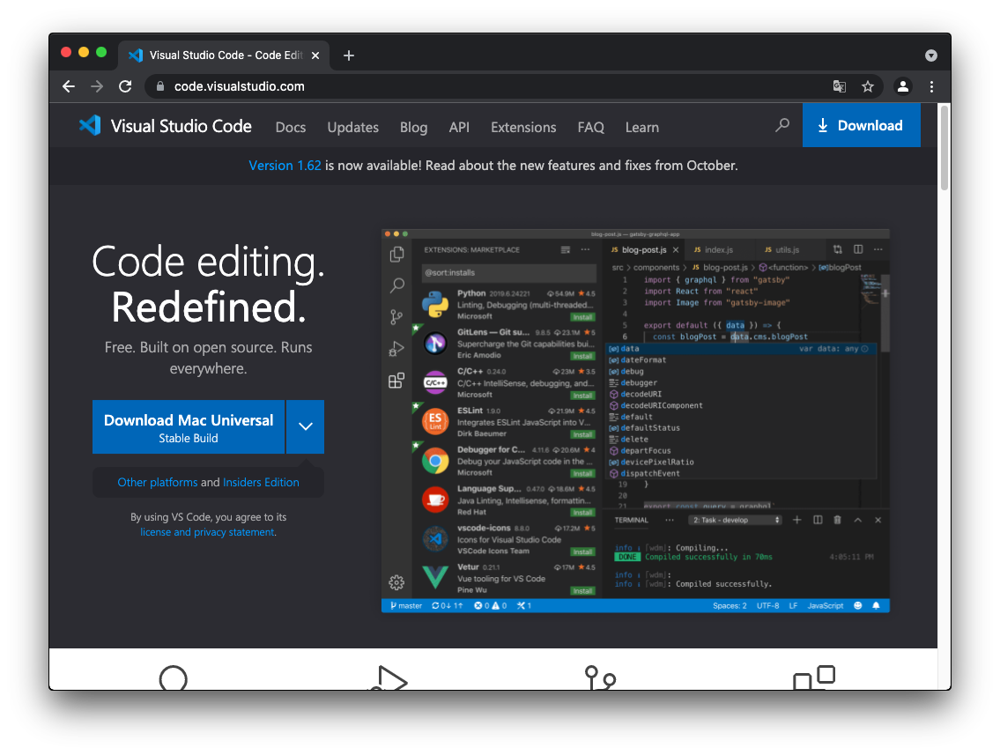
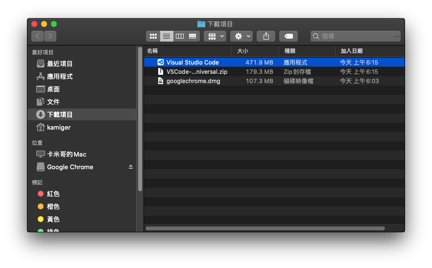
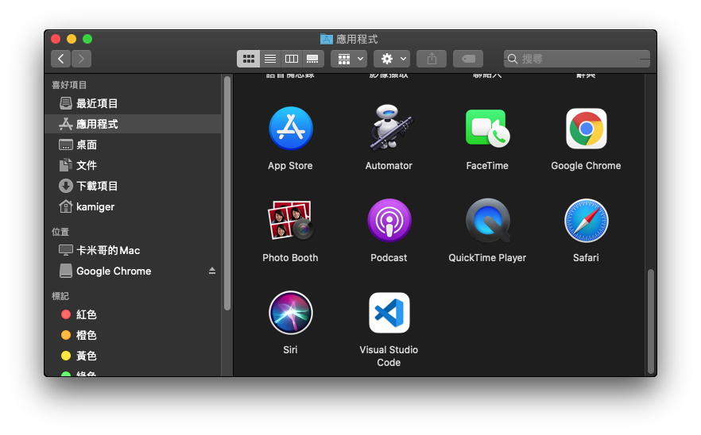
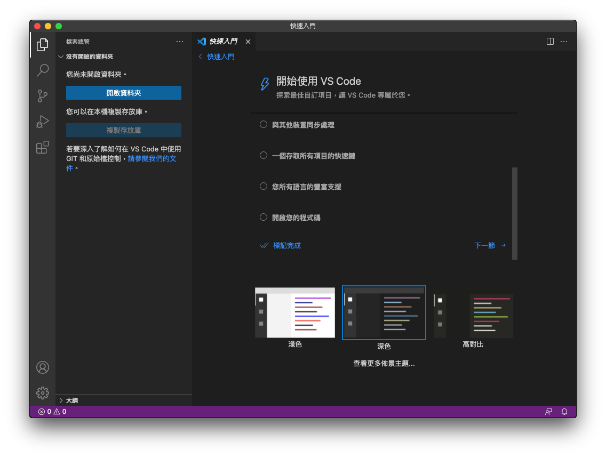
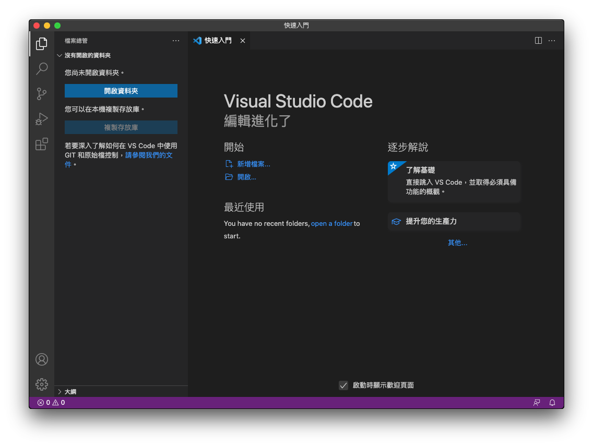

# 在 MacOS Catalina 安裝 Visual Studio Code

開啟網頁 [https://code.visualstudio.com/](https://code.visualstudio.com/)：

  

點擊 `Download Mac Universal` 下載安裝檔，下載完成後會獲得一個 zip 壓縮檔，雙擊 zip 壓縮檔後會獲得一個執行檔：

  

將其拖曳到應用程式內：

  

雙擊 `Visual Studio Code` 啟動：

  

點擊`打開`：

  

點擊右下角的`安裝並重新啟動`：

  

將右側卷軸捲至最底：

  

點擊`標記完成`：

  

至此完成安裝。