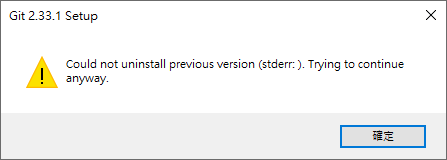
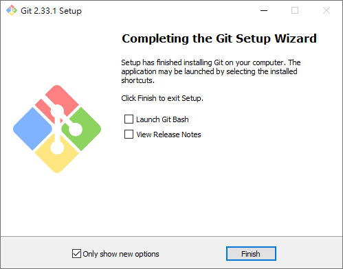
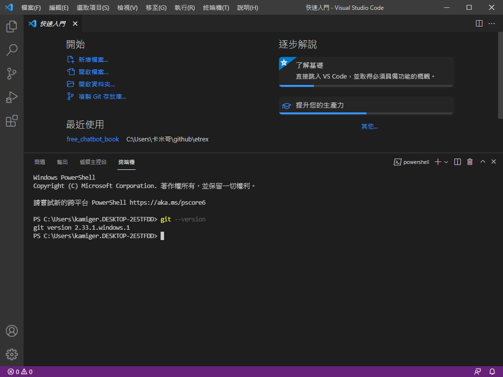

# 在 Windows 10 安裝 Git

開啟網頁 [https://git-scm.com/download/win](https://git-scm.com/download/win)：

  

點擊 `Click here to download manually` 下載安裝檔，下載完成後打開安裝檔：

點擊 `Next`：

  

點擊 `Next`：

  

點擊 `Install`：

  

每個人的電腦情況不同，你可能不會看到上面這個畫面，如果你看見了，點擊 `確定` 就好：

  

已完成 Git 的安裝，點擊 `Finish` 結束安裝。

# 確認是否安裝完成

開啟 Visual Studio Code，如果原本就是開啟的狀態，請先關閉後再開啟。

  

按下 `Ctrl + J`，開啟終端機：

  

輸入 `git --version` 查看安裝好的 git 版本：

  

結果應為 `git version...` 如上圖所示。
