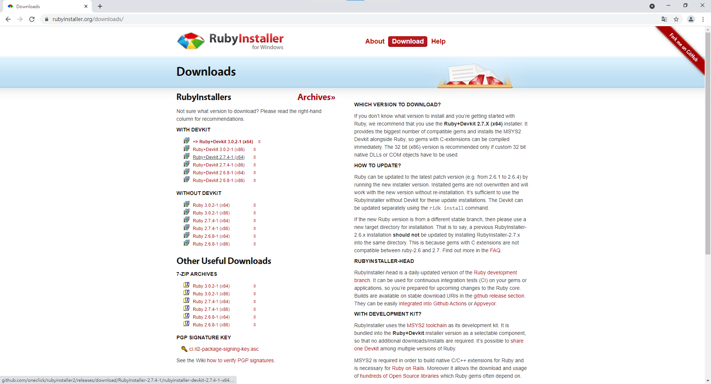
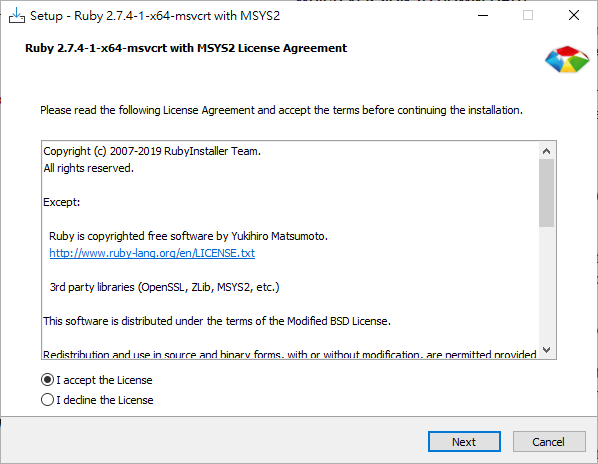
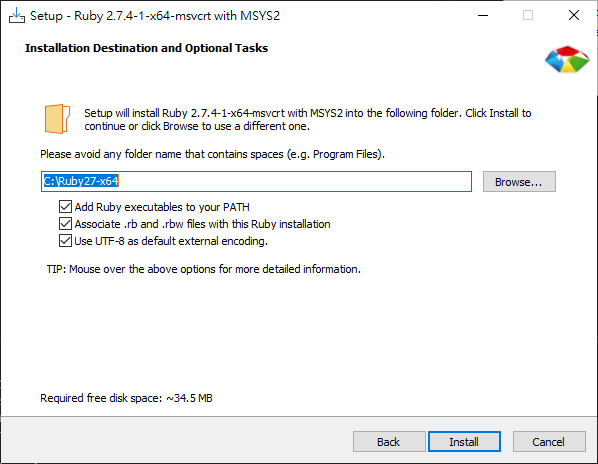
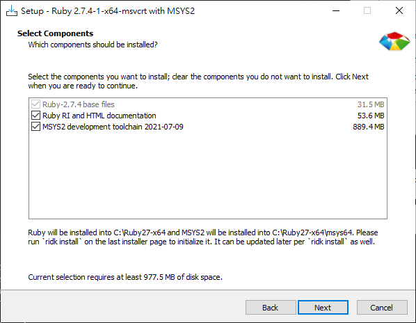
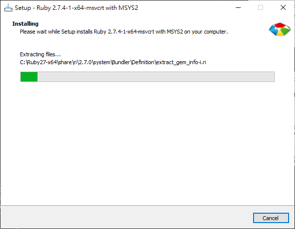
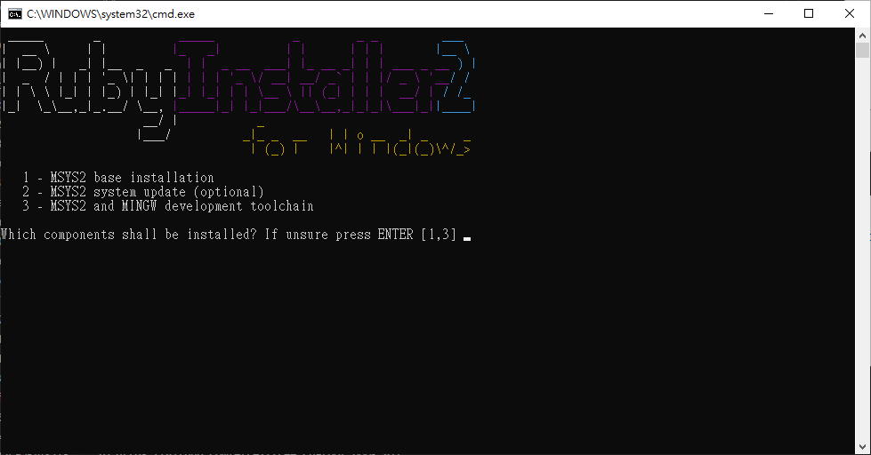
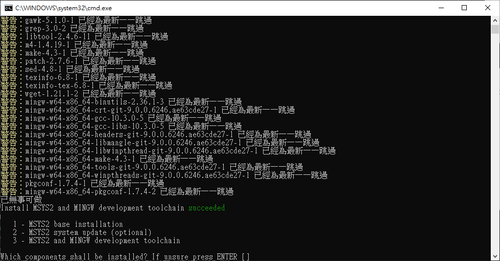
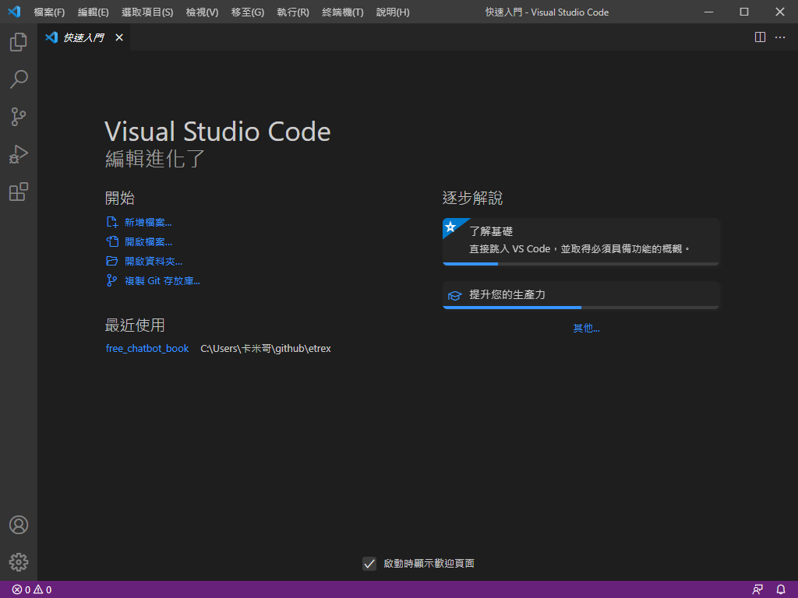
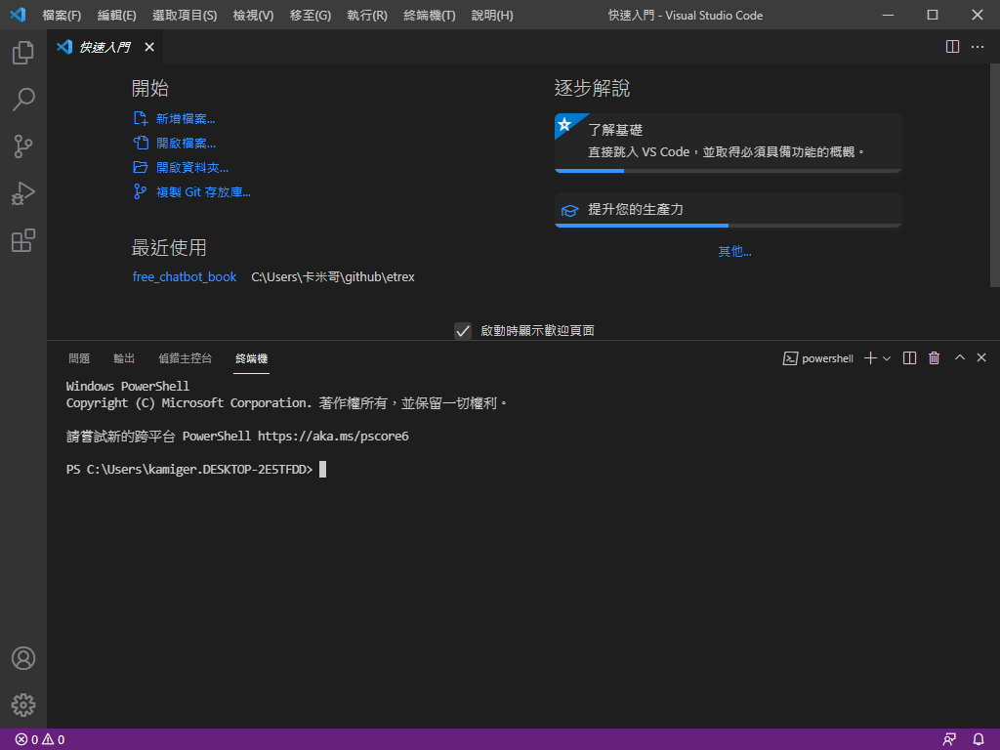
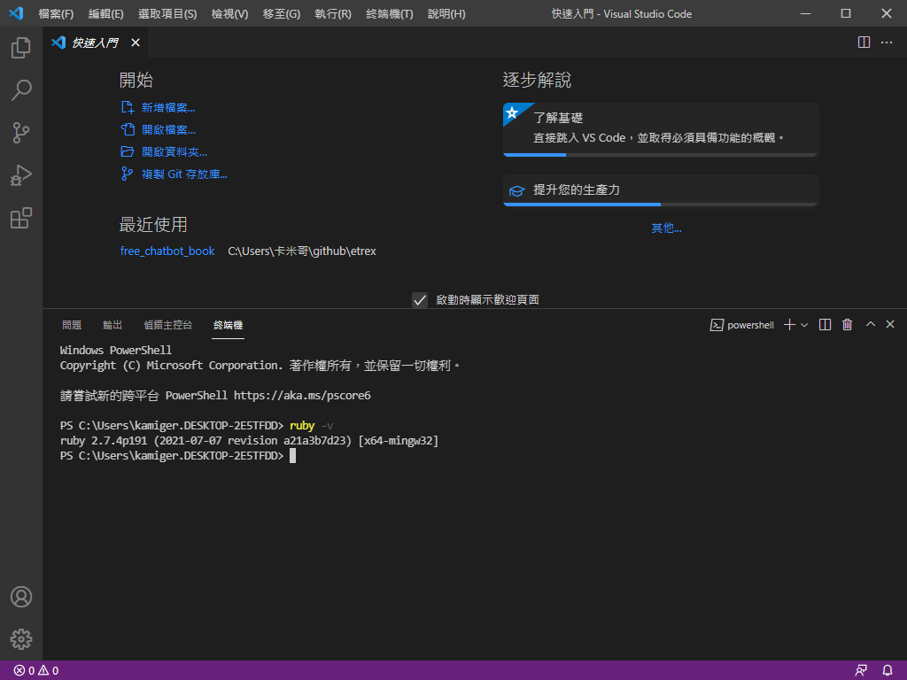

# 安裝 Ruby 2.7.4

開啟網頁 [https://rubyinstaller.org/downloads/](https://rubyinstaller.org/downloads/)：

  

點擊 `Ruby+Devkit 2.7.4-1 (x64)` 下載安裝檔，下載完成後打開安裝檔：

  

點擊 `I accept the Licence` 後，點擊 `Next`：

  

點擊 `Install`：

  

點擊 `Next`：

  

安裝中，等待安裝完成。

  

點擊 `Finish`：

  

按下 `Enter`，開始安裝 MSYS2：

  

再次按下 `Enter` 後，至此安裝完成。

# 確認是否安裝完成

開啟 Visual Studio Code，如果原本就是開啟的狀態，請先關閉後再開啟。

  

按下 `Ctrl + J`，開啟終端機：

  

輸入 `ruby -v` 查看安裝好的 ruby 版本：

  

結果應為 `ruby 2.7.4...` 如上圖所示。