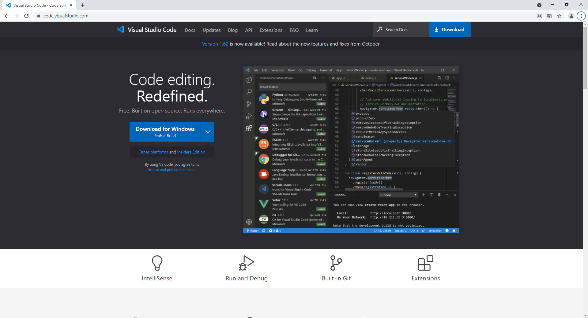
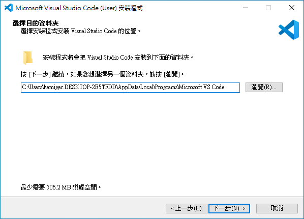
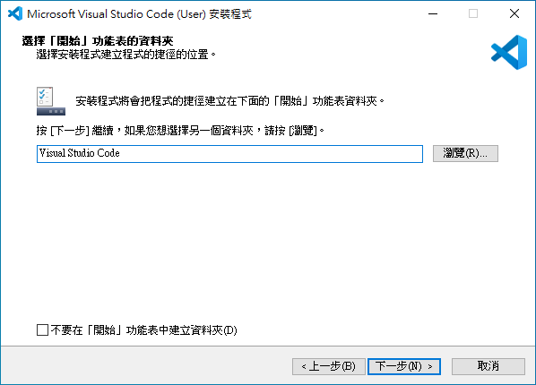
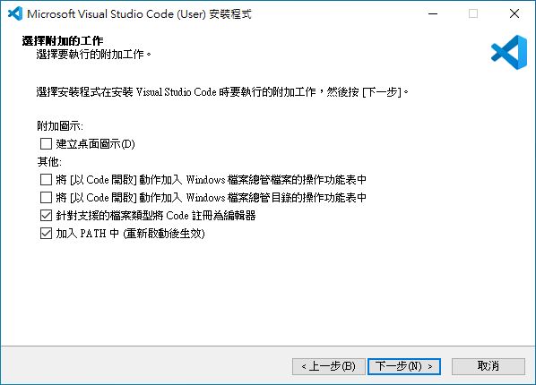
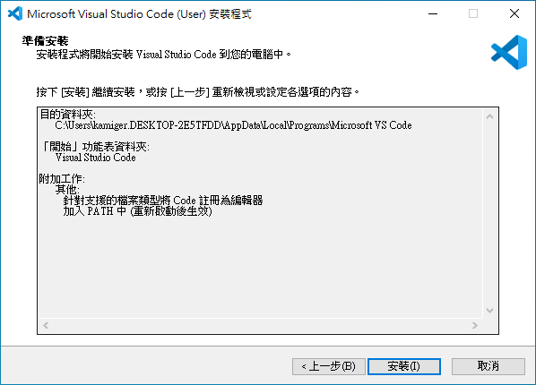
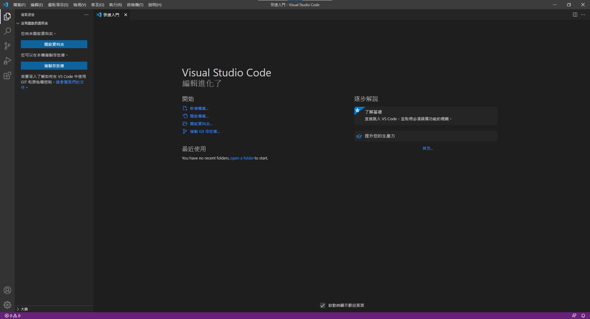

# 安裝 Visual Studio Code

開啟網頁 [https://code.visualstudio.com/](https://code.visualstudio.com/)：

點擊 `Download for Windows` 下載安裝檔，下載完成後打開安裝檔：

點擊`我同意`，再點擊`下一步`：

點擊`下一步`：

點擊`下一步`：

點擊`下一步`：

點擊`安裝`：

正在安裝，等待安裝完成。

安裝完成，點擊`完成`：

點擊右下角`安裝並重新啟動` 按鈕，安裝中文套件：

點擊`標記完成`略過初始設定，或者你想要隨著 Visual Studio Code 的引導進行初始設定。

到此就完成安裝 Visual Studio Code，這是 Visual Studio Code 的啟動畫面。
