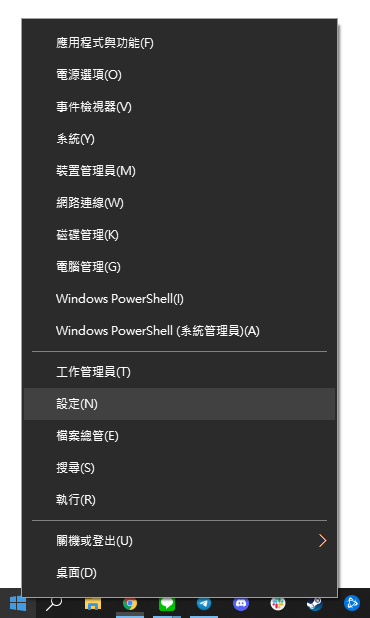
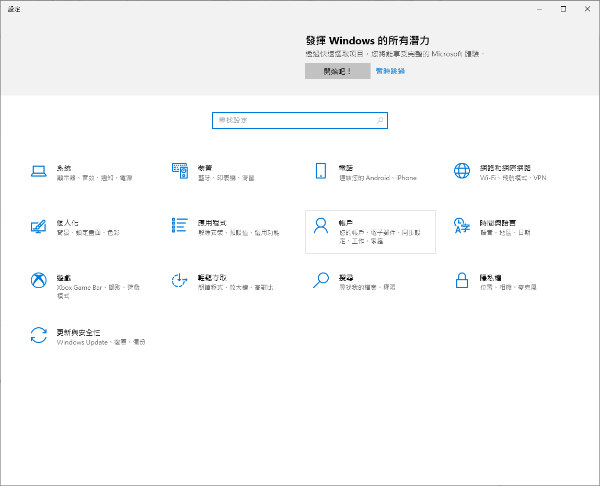
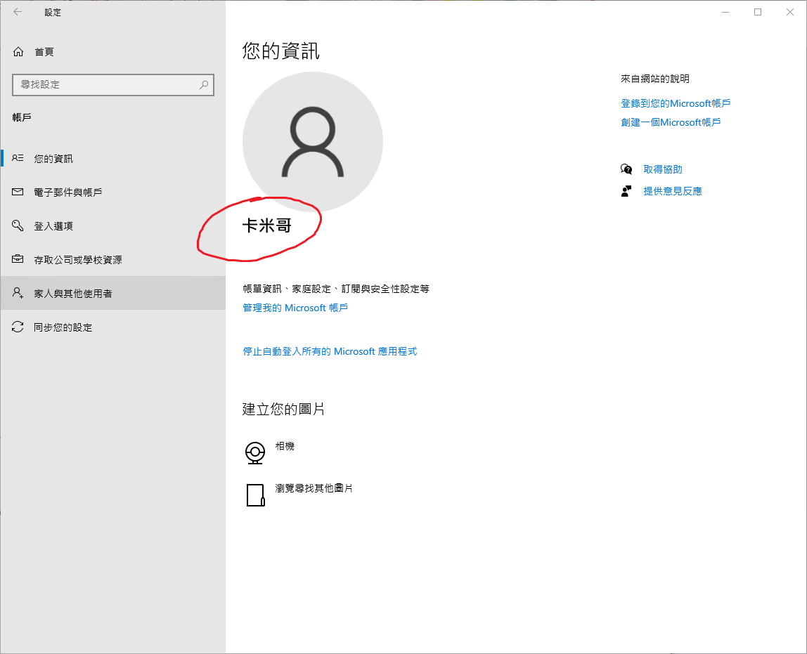
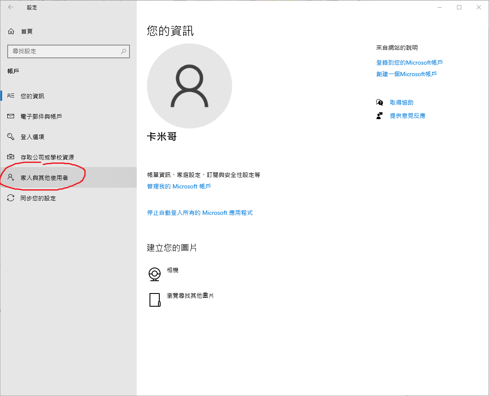
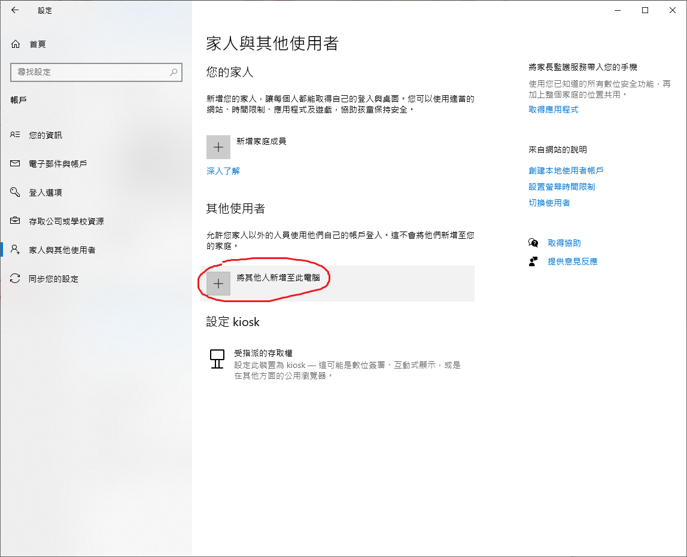
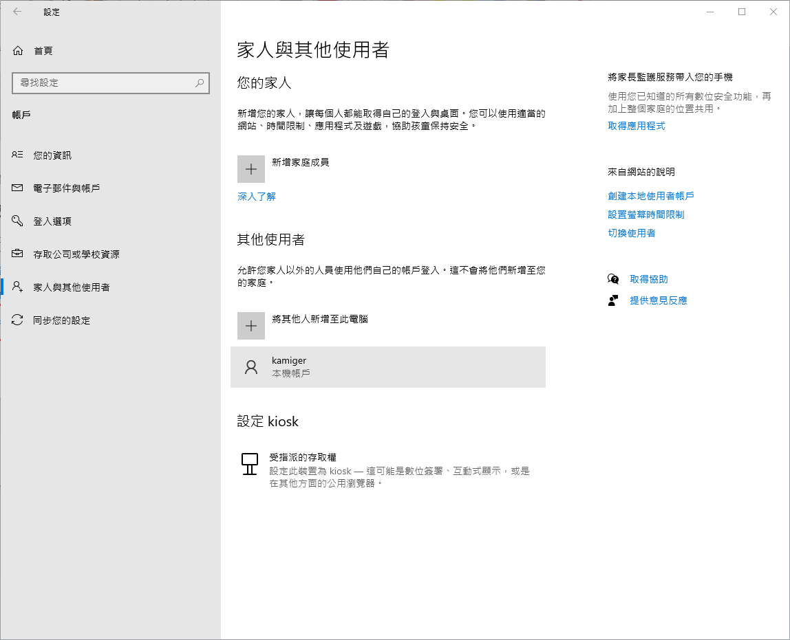
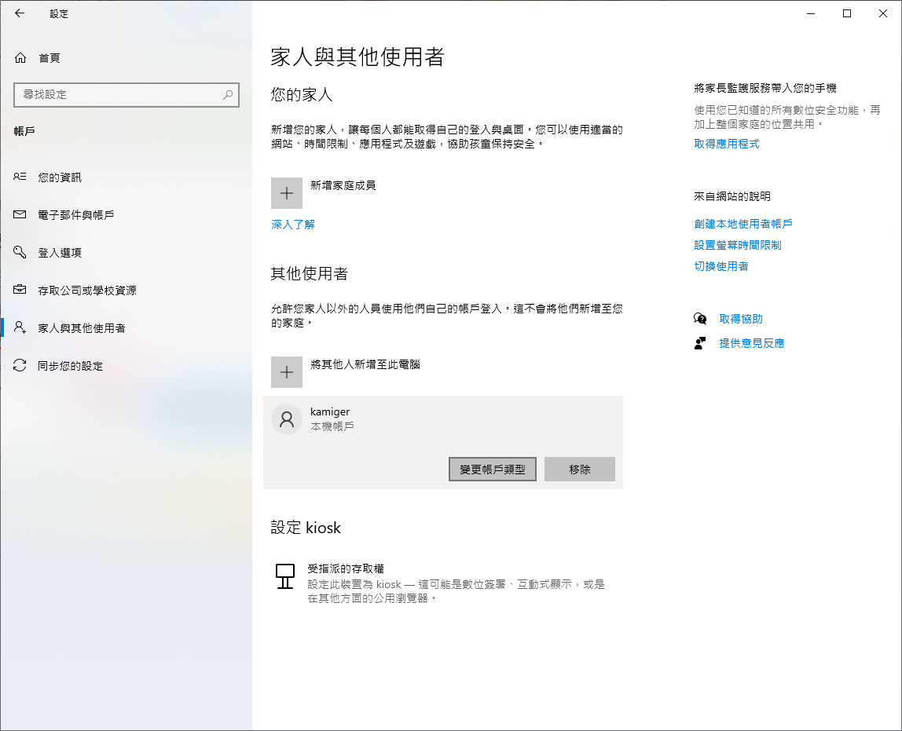
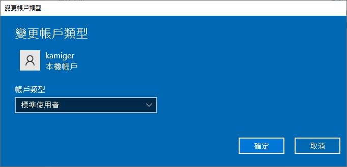
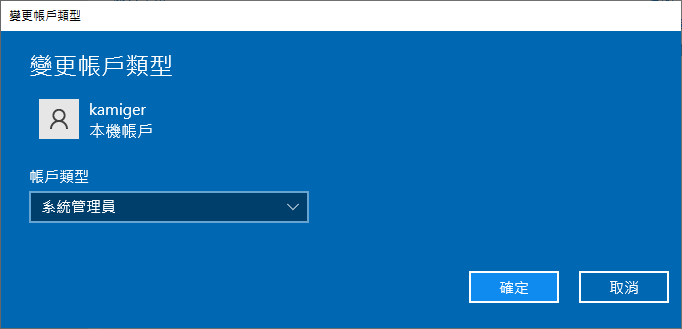
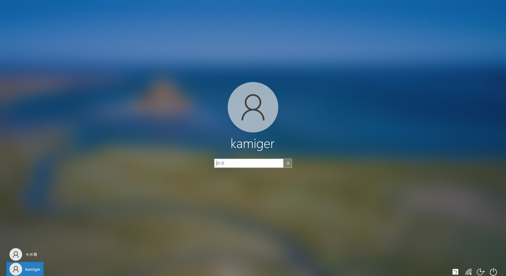

# 在 Windows 10 安裝 Rails 開發環境

以下安裝的軟體有相依性，請依照以下順序進行安裝：

- Visual Studio Code
- Ruby 2.7.4
- Rails 5.2.6
- Git
- Sourcetree
- PostgreSQL

注意，安裝的 Ruby 版本需為 2.7.4，而 Rails 版本需為 5.2.6，這是目前我測試過相對穩定的組合。

在開始安裝開發環境之前，首先必須確認目前登入的使用者名稱為英文。

在使用者名稱為中文的情況下，會有很多軟體在安裝時失敗，無法正確安裝。

# 確認使用者名稱為英文

在 Windows 圖示上點擊右鍵：

  

點擊`設定`：

  

點擊`帳戶`：

  

查看這個位置的顯示文字是否為英文，我的顯示卡米哥，代表我的使用者是中文名稱，無法正確安裝開發環境。

在這個狀態下，就需要新增一個使用者，使用新的使用者才能正確安裝開發環境。

# 建立新使用者

  

點擊左側的`家人與其他使用者`：

  

點擊`將其他人新增至此電腦`：

  

點擊`我沒有這位人員的登入資訊`：

  

點擊`新增沒有 Microsoft 帳戶的使用者`：

  

填寫新使用者的使用者名稱以及密碼，注意在`誰會使用這部電腦？`這個問題一定要填入全英文，填好之後點擊`下一步`：

  

到此已完成新使用者的建立。

# 設定使用者帳戶類型

點擊剛建立好的使用者：

  

點擊`變更帳戶類型`：

  

點選`標準使用者`，展開帳戶類型的下拉式選單：

  

點選`系統管理員`，將帳戶類型改為系統管理員：

  

點選`確定`：

  

到這裡，就可以登入新的使用者來安裝開發環境。

# 登入新的使用者

首先按下 `Windows + L` 鍵登出。

  

在左下角選擇新使用者登入，注意在這裡要看到新的使用者名稱為英文才行。

  

恭喜，接下來要安裝的是 Visual Studio Code