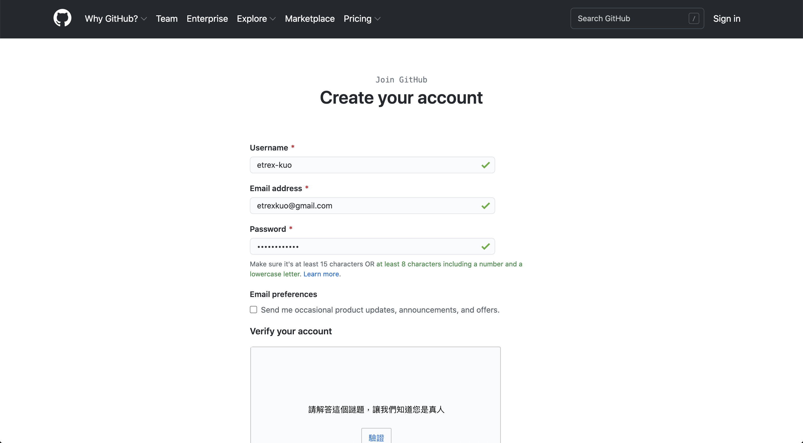
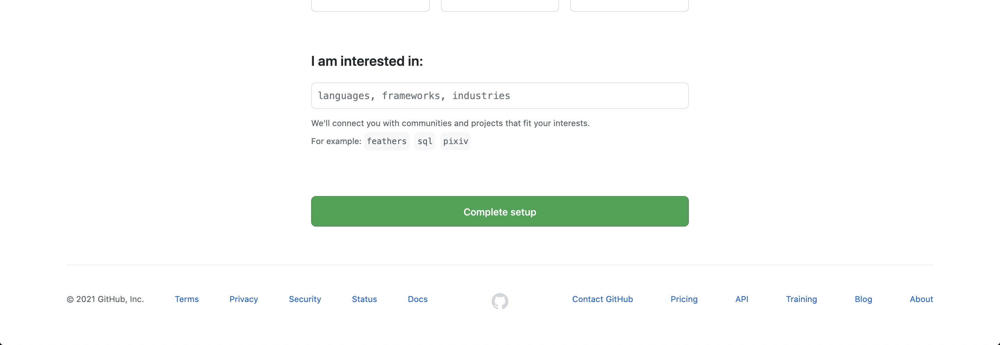
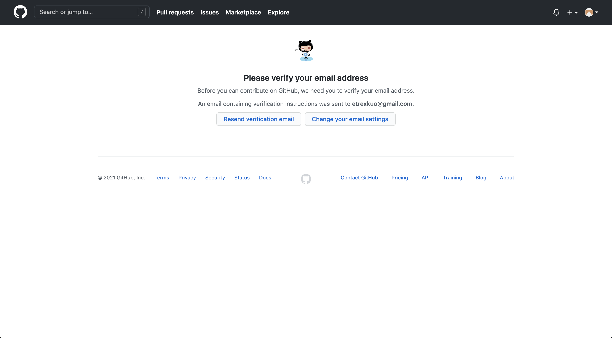

# 註冊 GitHub

開啟網頁 [https://github.com/](https://github.com/)：

點擊右上角 `Sign Up` 按鈕註冊：

填寫以下資訊：

- Username：使用者名稱
- Email address：電子信箱地址
- Password：密碼

填寫驗證碼後按下 `Create account` 按鈕建立帳號：

這裡直接按下 `Complete setup` 即可。

接著進行信箱驗證，請到剛剛填寫的電子信箱收信：

點擊信中的 `Verify email address` 完成信箱驗證：

看到以上畫面代表註冊成功。