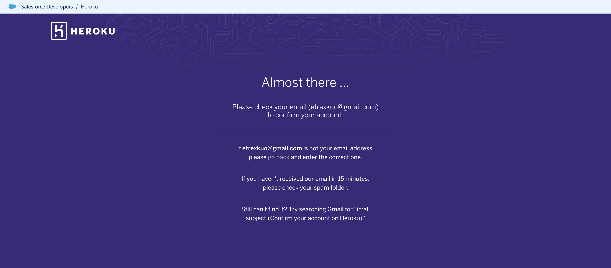
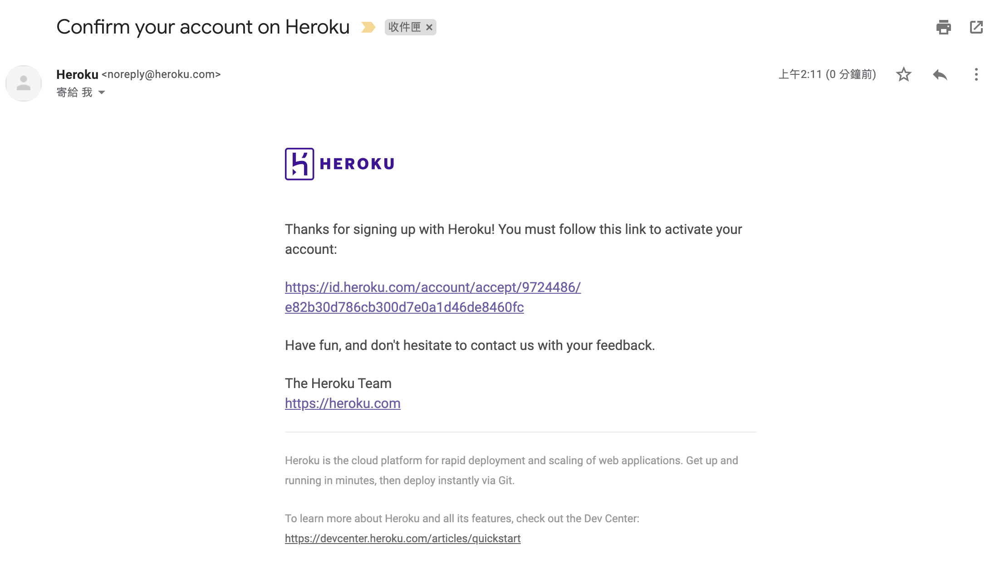
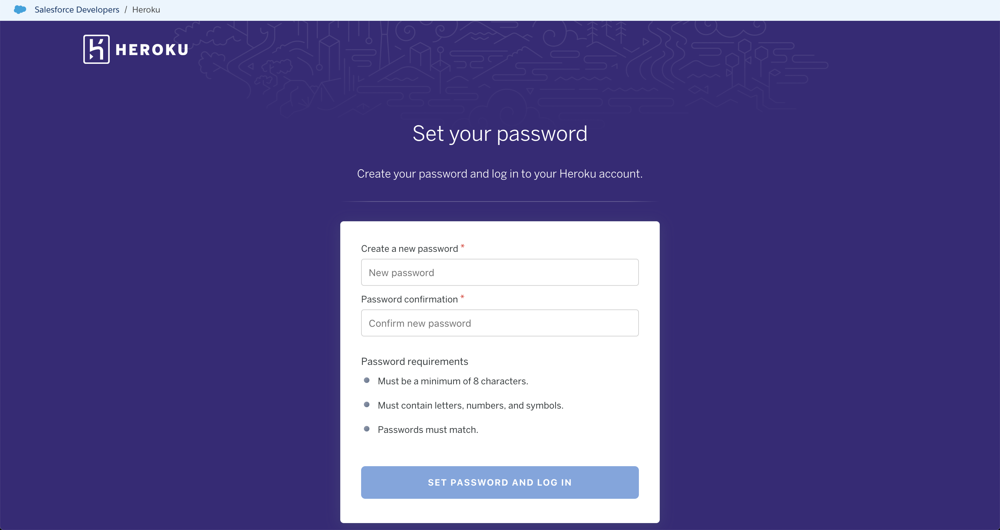
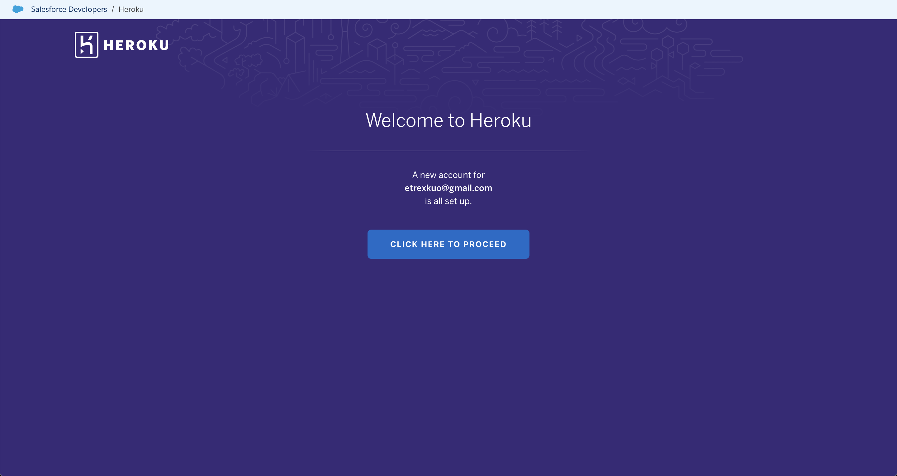
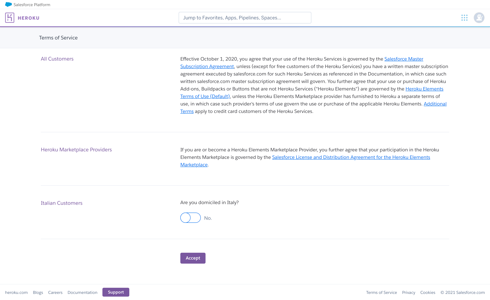
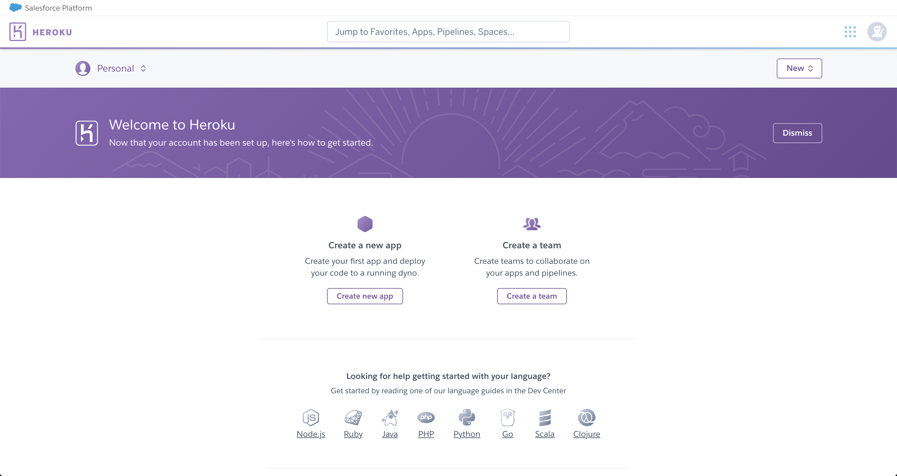

# 註冊 Heroku

開啟網頁 [https://www.heroku.com/](https://www.heroku.com/)：

請點擊右上角 `Sign Up` 按鈕：

填寫以下資訊：

- First name：名字
- Last name：姓氏
- Email address：電子信箱
- Company name：公司名稱，可不填
- Role：角色，可填 Student
- Country：國家
- Primary development language：主要使用的程式語言，選 Ruby

點擊驗證碼後按下 `CREATE FREE ACCOUNT` 按鈕建立帳號：

接著進行信箱驗證，請到剛剛填寫的電子信箱收信：

點擊信中的超連結，開啟密碼設定頁面：

- Create a new password：填寫密碼
- Password confirmation：再填一次密碼

密碼限制：
- 至少要 8 個字元以上
- 必須包含英文、數字以及符號

填寫完之後點擊 `SET PASSWORD AND LOG IN` 按鈕前往下一頁：

點選 `CLICK HERE TO PROCEED` 按鈕前往下一頁：

這是服務條款頁，點擊 `Accept` 按鈕前往下一頁：

看到此頁面代表完成註冊。
