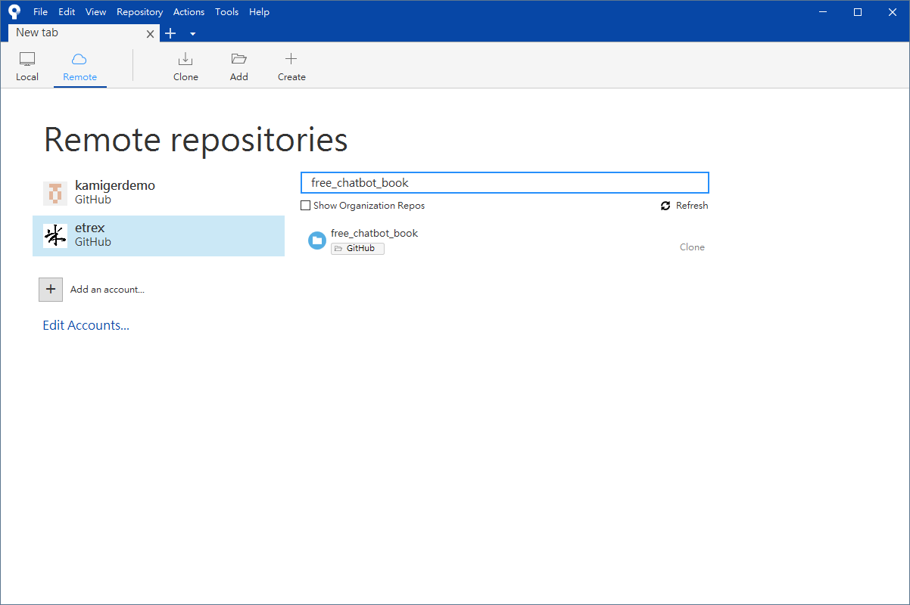
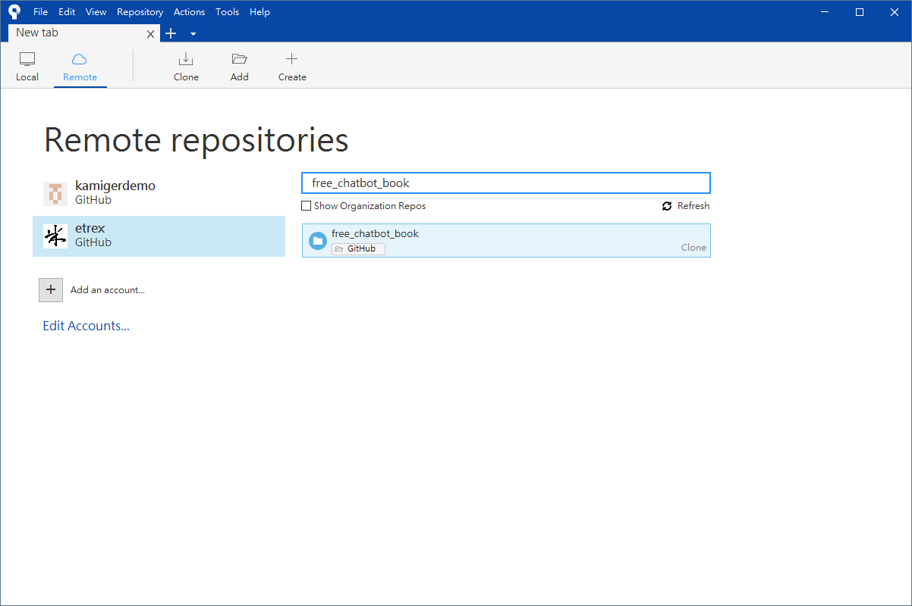
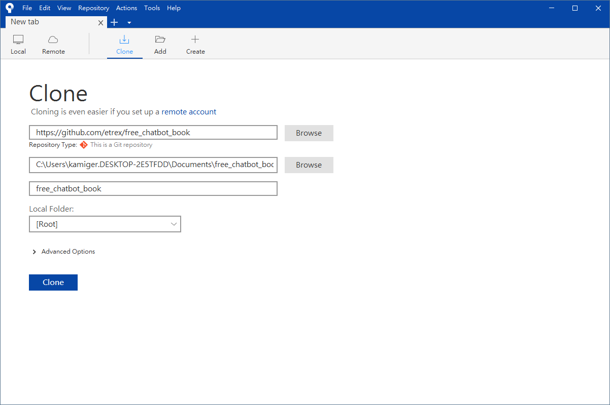
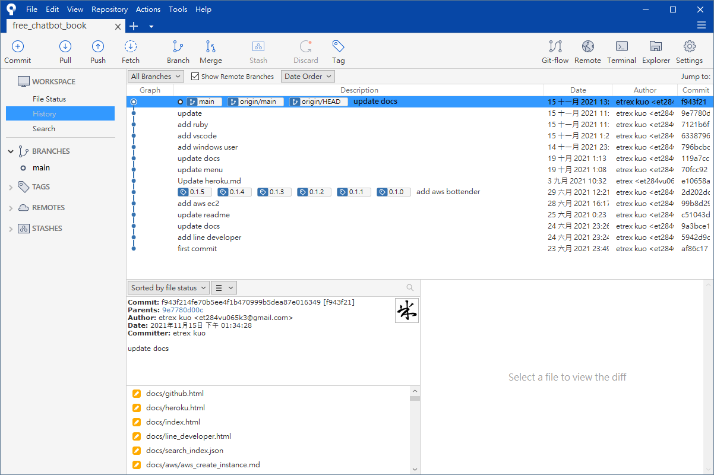
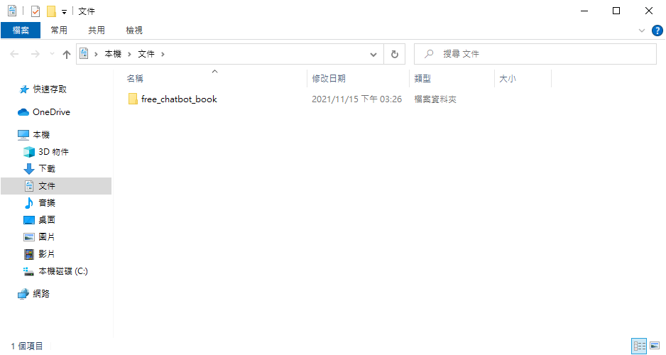

# 透過 Sourcetree 下載 GitHub 專案程式碼

透過 Sourcetree 下載 GitHub 專案程式碼到本機電腦的操作流程如下：

首先開啟 Sourcetree，開啟 Remote 分頁，若已連結 GitHub 帳號，則可以看見所有專案列表，或者你可以搜尋專案名稱找到你想要下載的專案：

  

選擇其中一個專案進行下載，在這裡我以 free_chatbot_book 作為示範：

  

點擊 `Clone`：

  

這裡可以指定要下載到哪裡，預設值是下載到目前登入的使用者下的`文件`資料夾，點擊 `Clone`：

  

看到上圖介面代表下載完成，可在上述指定路徑找到專案資料夾，因為我沒有修改預設值，所以是下載到我的`文件`資料夾，透過檔案總管進入看看：

  

現在可以使用 Visual Studio Code 開啟這個專案資料夾，來進行程式碼編輯。