# 在 Windows 10 安裝 PostgreSQL

開啟網頁 [https://www.enterprisedb.com/downloads/postgres-postgresql-downloads](https://www.enterprisedb.com/downloads/postgres-postgresql-downloads)：

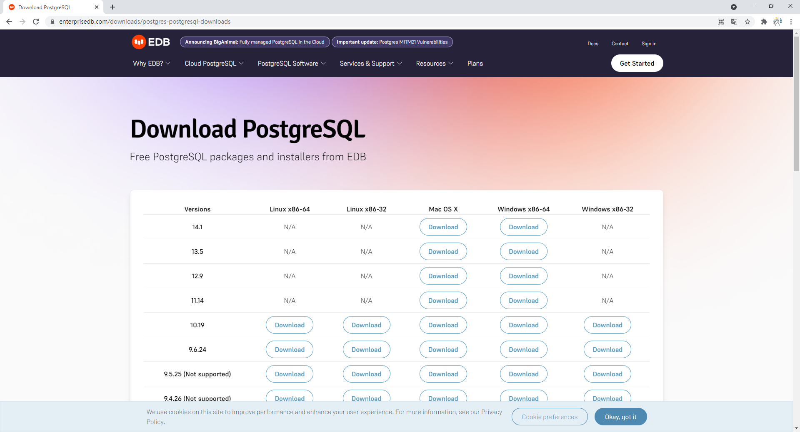  

點擊 `Windows x86-64` 下的 `14.1` 版本，如下圖所示：

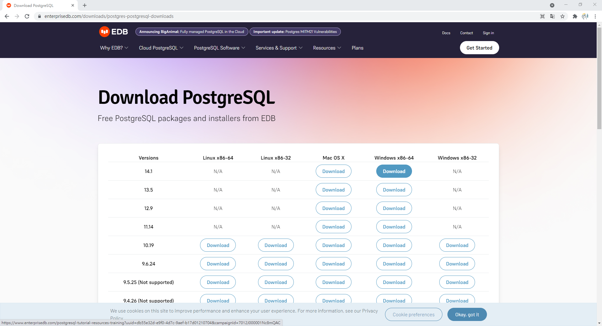  

點擊後應該會看到下圖，此時已經在下載安裝檔：

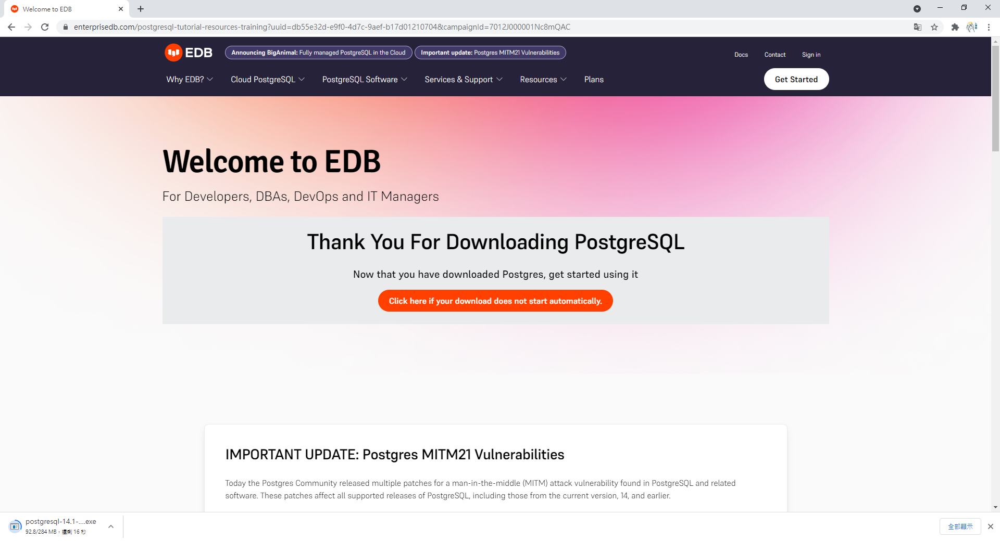  

若尚未開始下載安裝檔，就點擊 `Click here if your download does not start automatically.` 橘色按鈕。

下載完成後打開安裝檔：

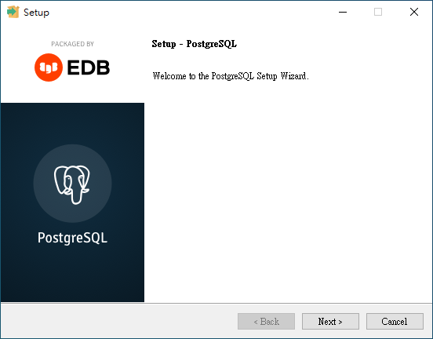  

點擊 `Next`：

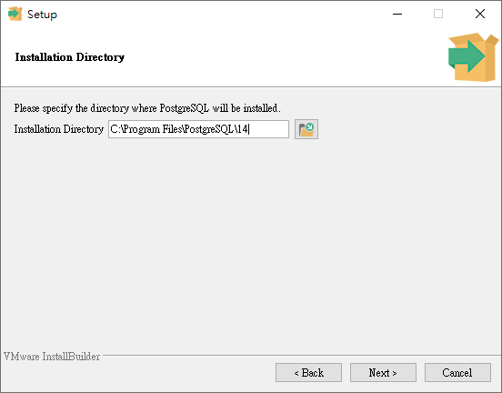  

點擊 `Next`：

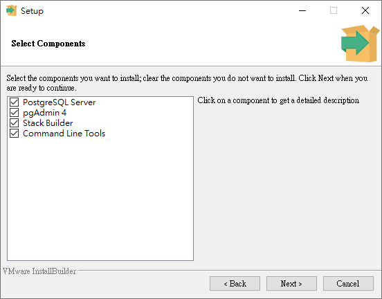  

點擊 `Next`：

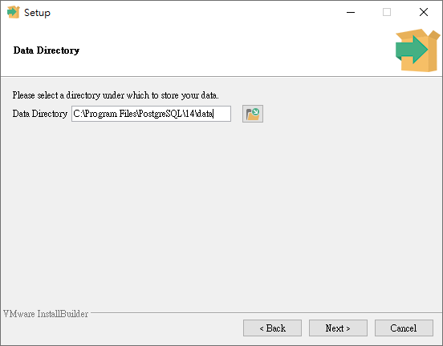  

點擊 `Next`：

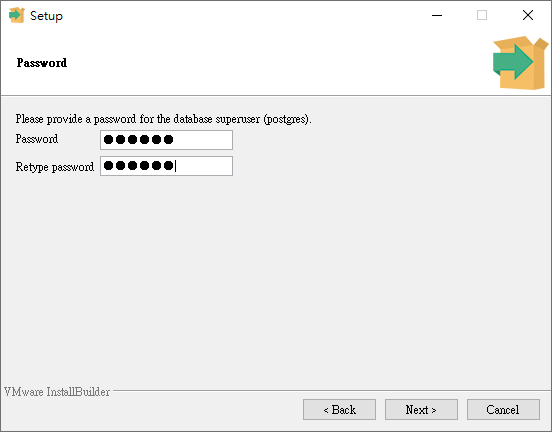  

這裡要設定超級使用者 postgres 的密碼，輸入密碼後，點擊 `Next`：

  

點擊 `Next`：

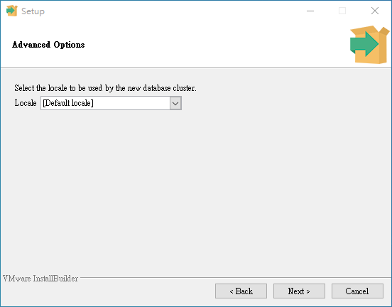  

點擊 `Next`：

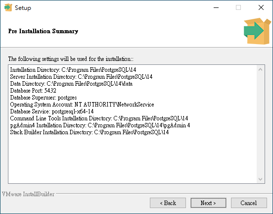  

點擊 `Next`：

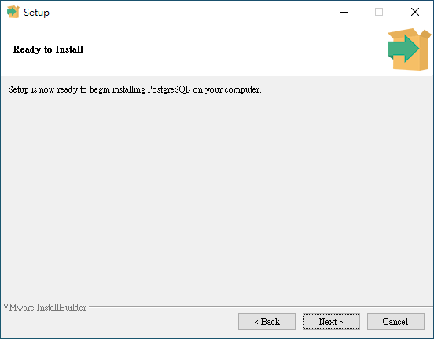  

點擊 `Next`：

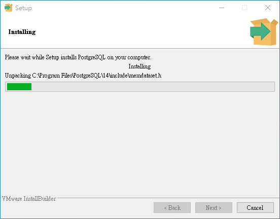  

安裝中，等待安裝完成。

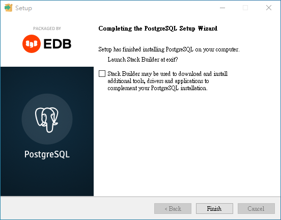  

至此安裝完成，取消勾選後點擊 `Finish`。

# 確認是否安裝完成

開啟 Visual Studio Code，如果原本就是開啟的狀態，請先關閉後再開啟。

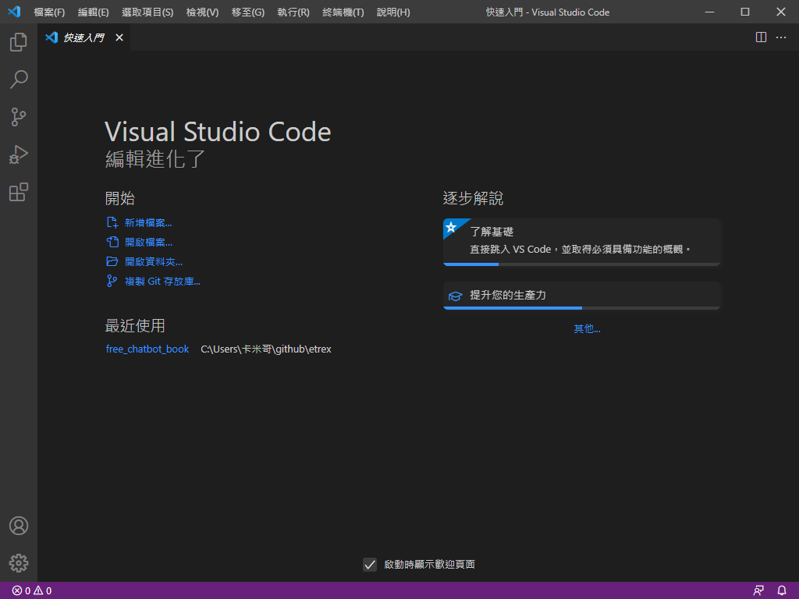  

按下 `Ctrl + J`，開啟終端機：

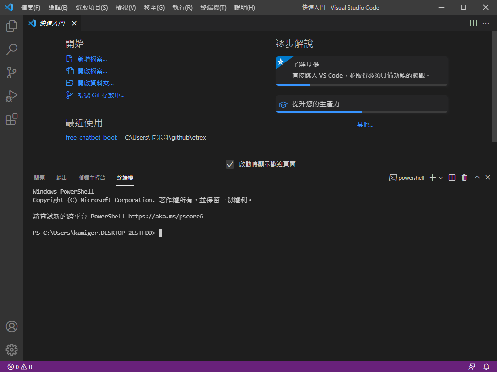  

輸入 `psql -U postgres` 嘗試連線到安裝好的資料庫伺服器：

  

會被要求輸入超級使用者 postgres 的密碼：

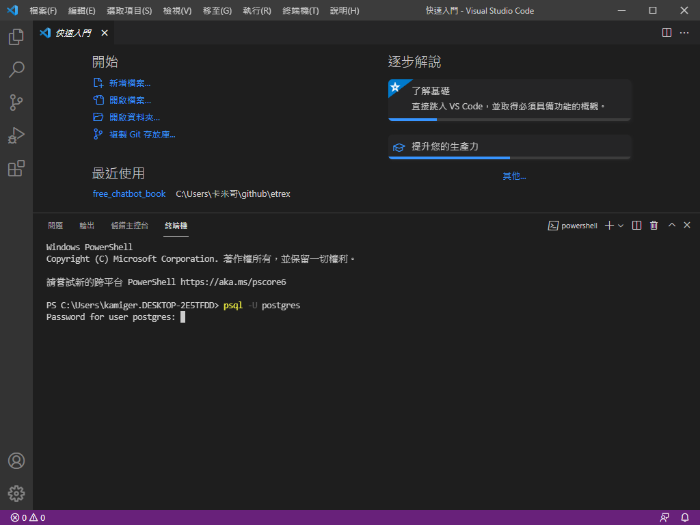  

輸入好密碼後按下 `Enter`：

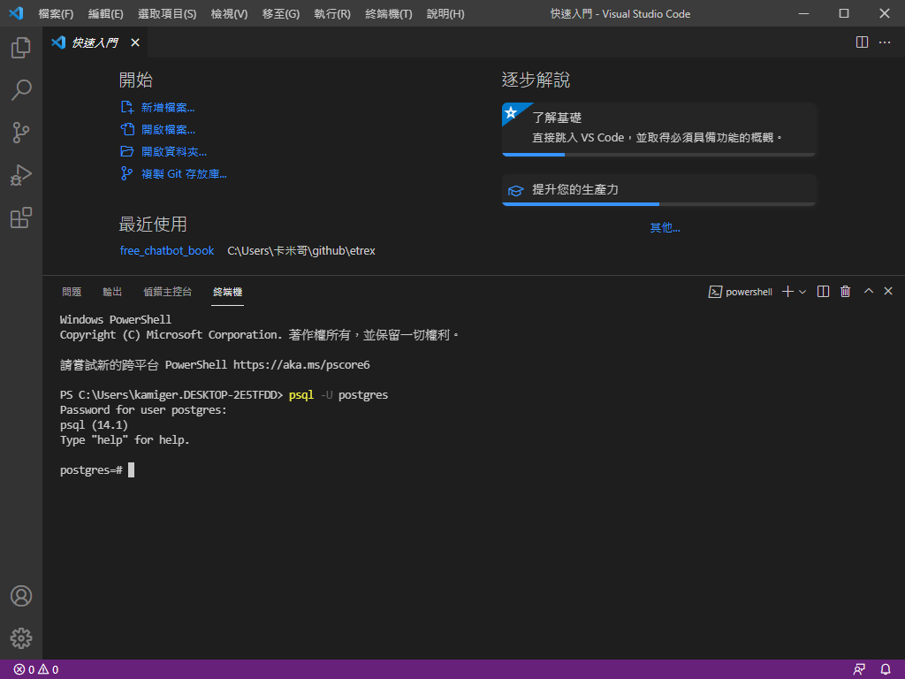  

看到上述畫面就代表安裝成功，輸入 exit 離開 PostgreSQL：

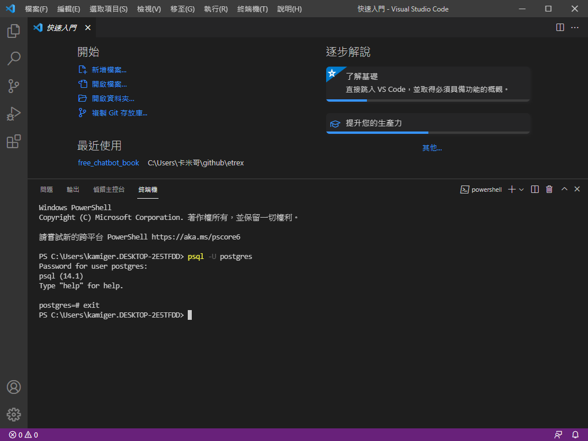  
