# 在 Windows 10 安裝 Sourcetree

開啟網頁 [https://www.sourcetreeapp.com/](https://www.sourcetreeapp.com/)：

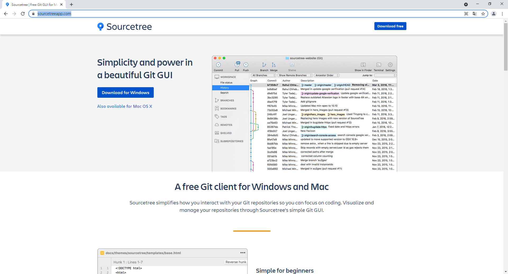  

點擊 `Download for Windows`：

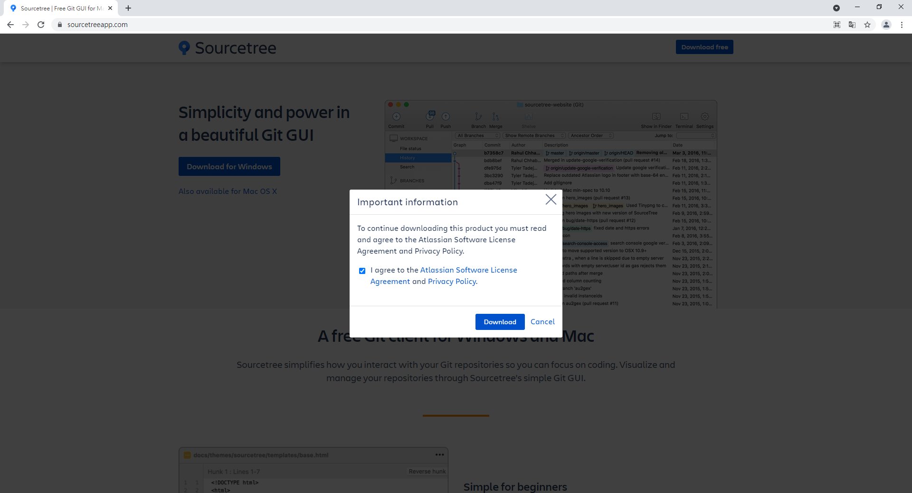  

同意條款並點擊 `Download`，下載安裝檔，下載完成後打開安裝檔：

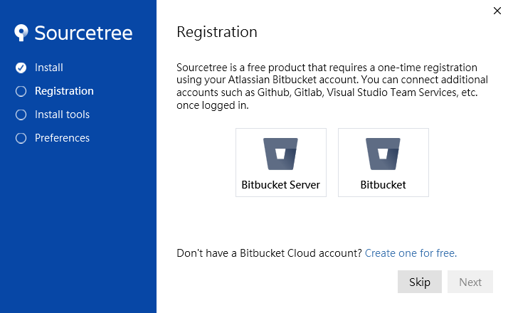  

點擊 `Skip`：

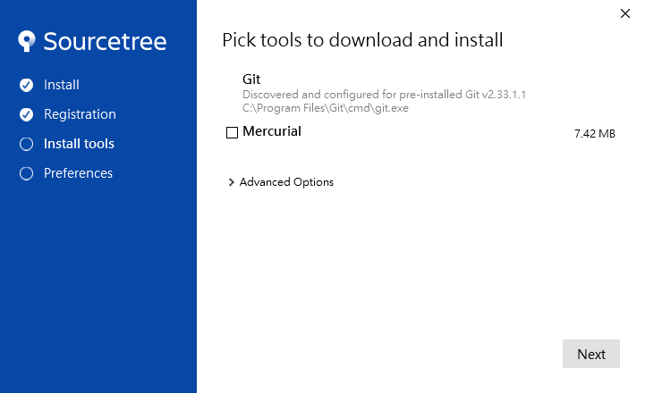  

取消勾選 Mercurial 後，點擊 `Next`：

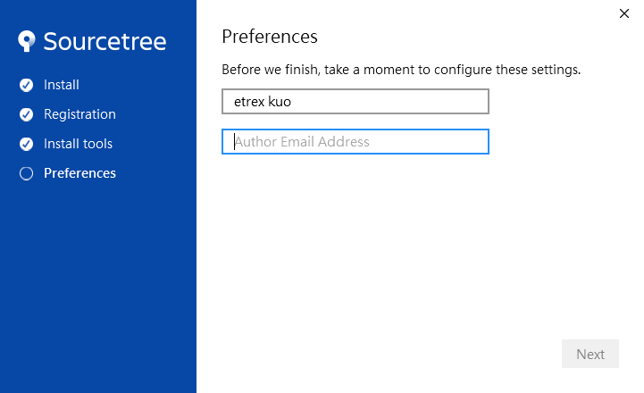  

輸入顯示名稱以及 email 後，點擊 `Next`：

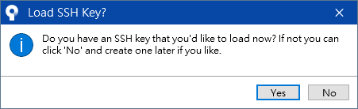  

點擊 `No`：

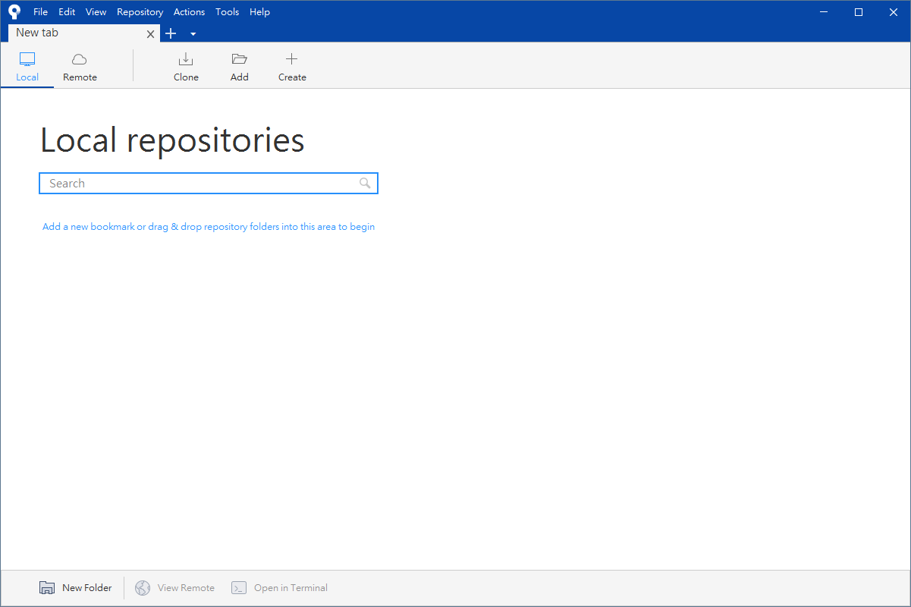  

至此已安裝完成，接下來要連結 GitHub 帳號。

# 連結 GitHub 帳號

點擊 `Remote`：

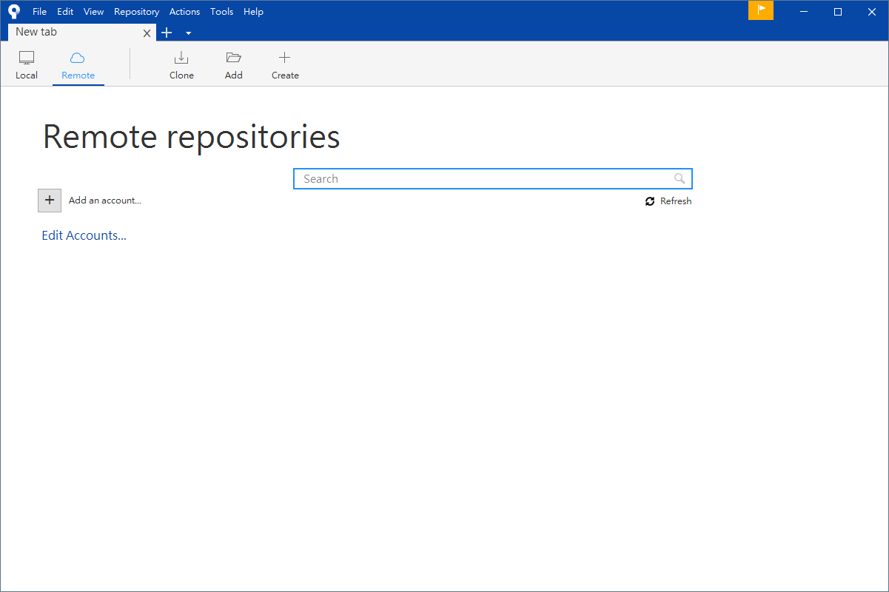  

點擊 `Add an account...`：

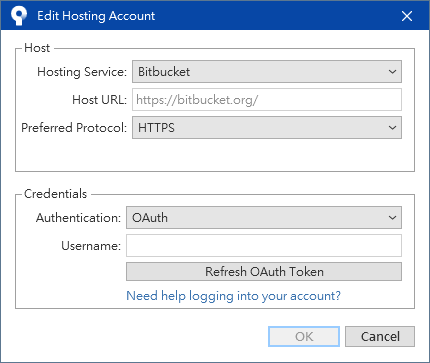  

點擊 `Bitbucket`，展開下拉式選單：

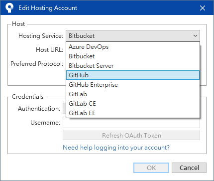  

選擇 `GitHub`：

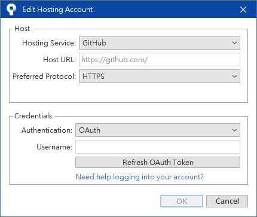  

點擊 `Refresh OAuth Token`，會開啟一個授權網頁，如果你已經登入 GitHub 會看到下圖：

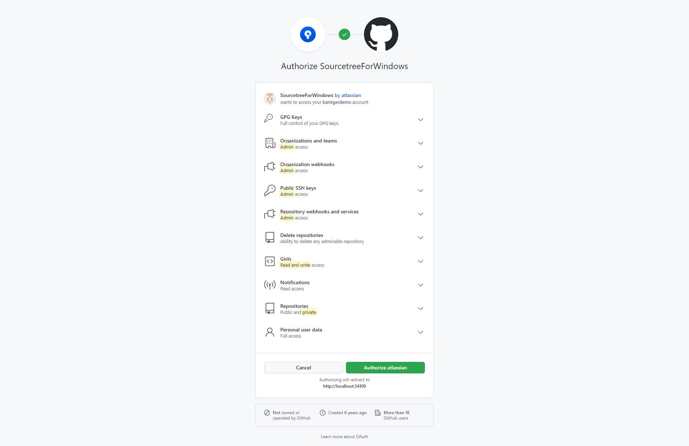  

點擊 `Authorize atlassian`，授權 GitHub 相關權限給 Sourcetree。

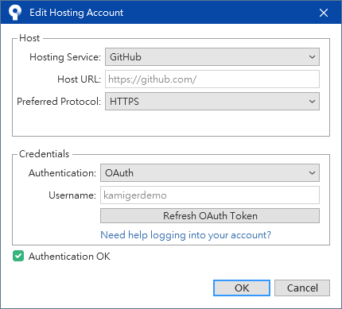  

看到 Username 以及下方的 Authentication OK 表示授權成功，點擊 `OK`。

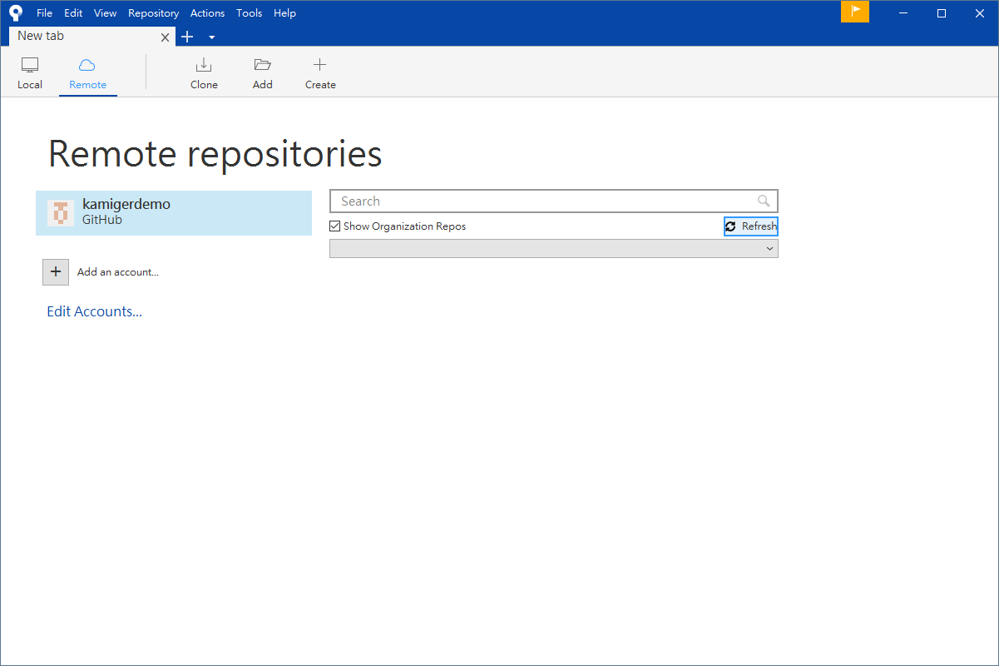  

點擊 `Refresh` 可以載入你在 GitHub 上的所有專案：

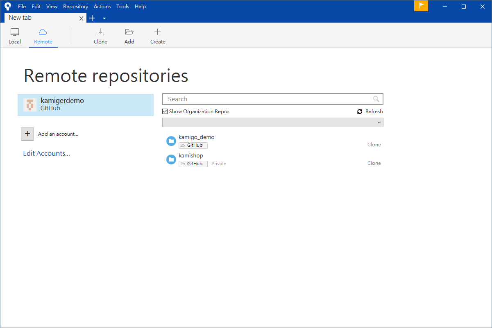  

至此已完成與 GitHub 帳號的連結，可以透過 Sourcetree 順利上傳下載程式碼。