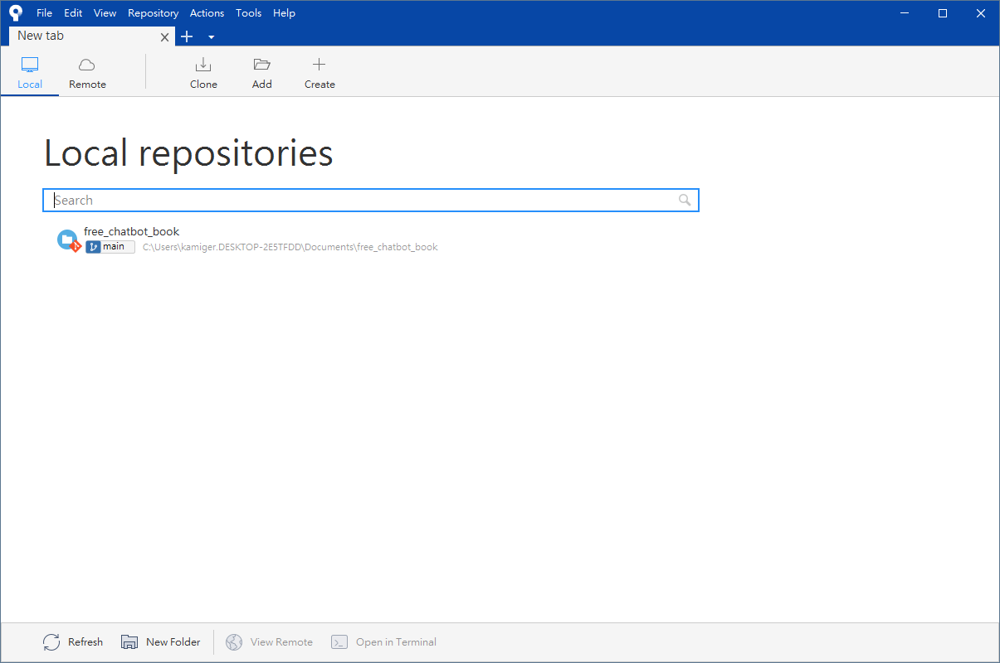
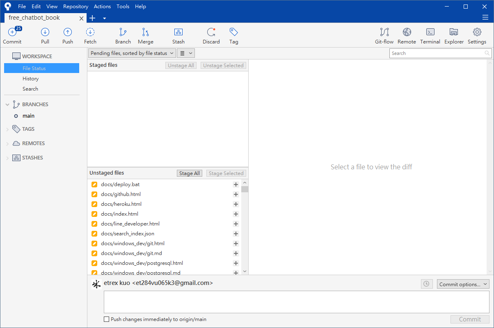
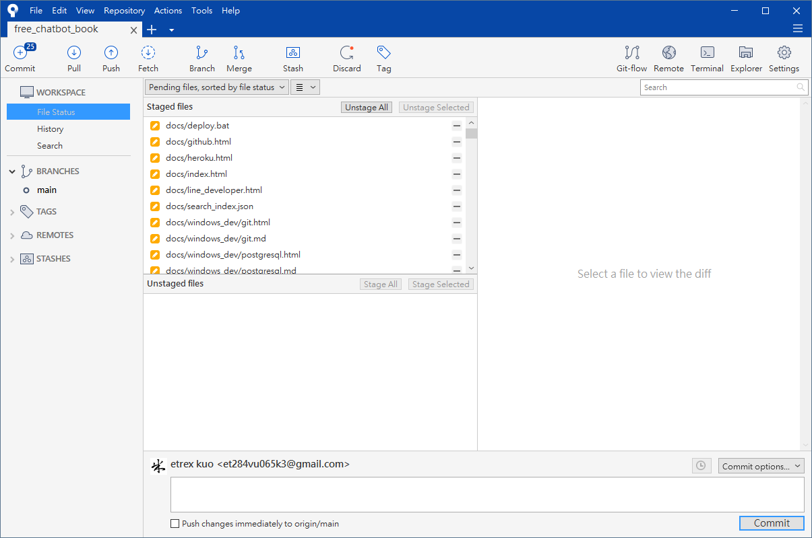
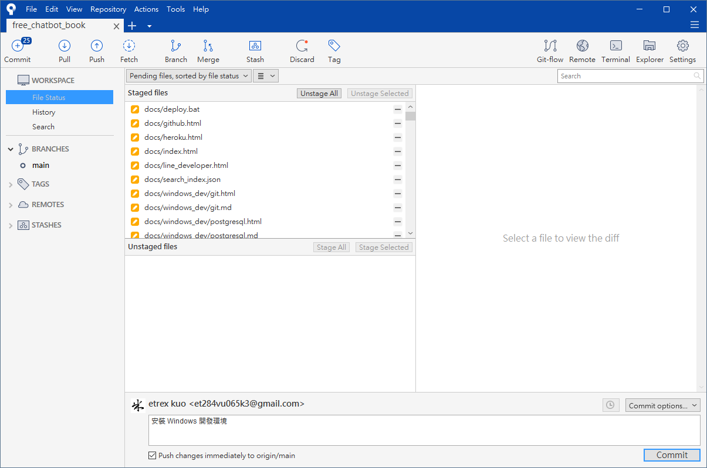
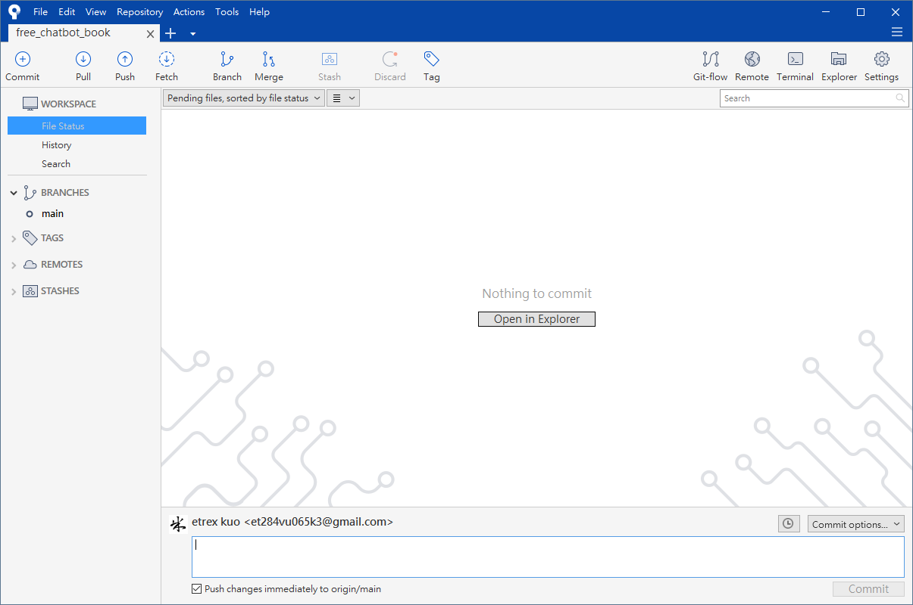

# 上傳專案程式碼

注意：你必須先透過 Sourcetree 下載專案程式碼，在此情況下修改專案資料夾內的檔案，才能透過以下教學上傳專案程式碼。

透過 Sourcetree 上傳專案程式碼到 GitHub 的操作流程如下：

啟動 Sourcetree，切換到 Local 分頁：

  

選擇本機專案資料夾路徑進入專案；

  

可以看見目前修改過的檔案列表，點擊 `Stage All` 表示所有的變更都要保存到 Git。

  

在下方輸入一段文字來描述這次修改的內容，並且勾選 `Push changes immediately to origin/main`：

  

點擊右下角 `Commit` 將本次變更保存到 Git 並同時上傳到 GitHub：

  

至此就完成了上傳專案程式碼。

# 確認是否上傳成功

開啟 GitHub 網頁的專案頁面，可以看到最近一次更新是在 40 秒前：

  
